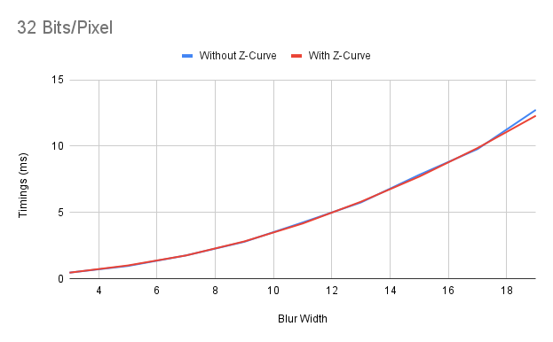
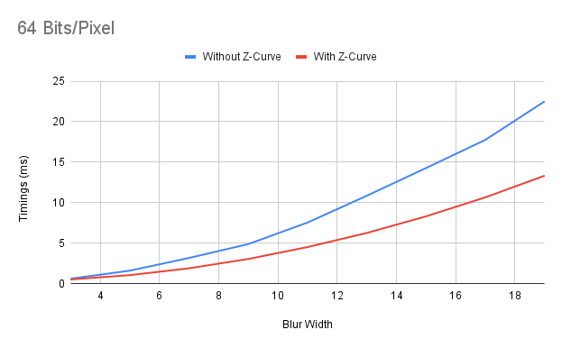
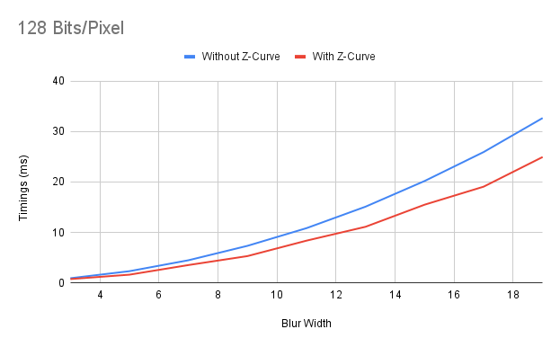

# A Tale Of Too Many Blurs - Part 1


Recently, in an attempt to highlight various compute shader optimizations, I decided to implement a variety of blurs to provide a concrete example for each optimization.

I... may have gone a bit overboard.

In the process of writting this blog post, I ended up writting 7 major blur variations.

They get pretty complex but we'll build up to each version and provide reasoning behind each variation.

Feel free to sit back, relax, and enjoy the show!

## What's The Plan, Stan?

Throughout this series, we're going to touch on a subset of our blur variations and their performance characteristics.

Some caveats:
- I'll be using an RTX 3070 TI as my baseline GPU. That's what I have on-hand, so that's what we'll use.
- These aren't meant to be the be-all-end-all of blur shaders. They're primarily for illustrating the various ideas presented here.
- I expect the reader to be generally familiar with writting simple blurs.
- I expect the reader to be generally familiar with writting simple compute shaders.

## Letsa go!

To kick us off, we're starting with the most basic blur.

A two-dimensional blur of radius `NxN`.

In essence, to write a two dimensional blur, we simply need to read the `NxN` neighbourhood of our current pixel and apply a weight to each neighbour.


The weight that we apply depends on the type of blur we want to use.

For this case, let's use a 3x3 box blur where each weight has the same value (in this case, this would be 0.11111111111111111)


A basic 3x3 box blur shader could look like this:

```
[numthreads(BlurThreadGroupWidth, BlurThreadGroupWidth, 1)]
void boxBlurCS(uint3 dispatchId : SV_DispatchThreadID)
{
    static uint const blurOffsetCount = 9;
    static float const blurWeight = 1.0f / (float)blurOffsetCount;
    int2 blurOffsets[9] =
    {
        int2(-1, -1), int2( 0, -1), int2( 1, -1),
        int2(-1,  0), int2( 0,  0), int2( 1,  0),
        int2(-1,  1), int2( 0,  1), int2( 1,  1)
    };

	float4 blur = 0.0f;
	for(uint i = 0; i < blurOffsetCount; i+=4)
	{
        int2 readIndex = clamp((int2)dispatchId.xy + blurOffsets[i],
            int2(0, 0), int2(BlurConstants.SourceWidth - 1, BlurConstants.SourceHeight - 1));
        blur += Source[readIndex] * blurWeight;
	}

	Output[dispatchId.xy] = blur;
}
```

With this basic shader, we can already optimize it without any algorithmic modifications.

(If you're yelling "WHAT ABOUT SEPARABILITY?" at your screen - don't worry, we'll get there!)

Let's start off by gathering statistics on this simple blur.

For a 4096x4096 texture at bits per pixel, our timings come out as:

```
32 Bits/Pixel: 0.17ms
64 Bits/Pixel: 0.26ms
128 Bits/Pixel: 0.56ms
```

### Morton/Z Order Curves

Something quick and easy we can do, is instead of accessing our textures using the default row-order access of our threads, we can use a Z-Order curve in order to improve our texture access cache locality within a wave/thread group.

We won't be touching on Morton-like storage of textures in this post. See [\[1\]][Link 1] for some more information on the topic. 

In order to implement a Z-Order curve, we can simply pack all of our even bits into an integer for our X coordinate and all of our odd bits into an integer for our Y coordinate.

```
uint packEvenBits16(uint value)
{
	value &= 0x55555555;
	value |= (value >> 1);
	value &= 0x33333333;
	value |= (value >> 2);
	value &= 0x0000000F; // Clamp to 15

	return value;
}

uint2 zCurve16x16(uint index)
{
	return uint2(packEvenBits16(index), packEvenBits16(index >> 1));
}
```

Using this is as simple as modifying our `dispatchId`.

```
void blurCS(uint threadIndex : SV_GroupIndex,
	uint2 groupId : SV_GroupID,
	uint3 dispatchId : SV_DispatchThreadID)
{
	dispatchId.xy = zCurve16x16(threadIndex) + groupId * BlurThreadGroupWidth;
```

With these modifications, our timings come out as:

```
32 Bits/Pixel: 0.17ms
64 Bits/Pixel: 0.26ms
128 Bits/Pixel: 0.54ms
```

Notice that we only really measure benefits for 128 Bits/Pixel in our use case.

This has a relatively intuitive reasoning. In our particular case, our blur kernel is pretty small. This means we don't really access that much memory in the first place.

As a result, we don't necessarily evict that much memory from cache in the first place.

### Rules Of Thumb

Some general rules of thumb I've identified in using Z-Curve access are:
- As always, measure to see if you observe any benefits in your particular use case.
- The larger your texel format, the more likely you are to observe benefits.
- The larger your blur radius, the more likely you are to observe benefits.

### Larger Blur Radii

In a future post, we'll extend this blur in order to use a dynamic blur radius.

But in order to highlight the potential benefits of using Z-Curves, here are the results with various blur widths.

At 32 Bits/Pixel, we don't see much of a different between using Z-Curves and not.



When we use 64 Bits/Pixel, we already start seeing a substantial divergence between the use of a Z-Curve and not.



When we use 128 Bits/Pixel, the trend we saw with 64 bits continues with our Z-Curve based blur dramatically out-performing the version without.



## Conclusion

Even with a simple 3x3 box blur like the one above, we can see performance improvements simply through improved memory accesses at the cost of a few additional instructions.

When we start increasing our blur to larger radii, the benefits can be dramatic.

In the next part of this series, we'll be modifying our blur such that we can support a variable blur kernel instead of being stuck to a fixed 3x3 blur.

With that change will come new optimization opportunities.

See you next time!

## Appendices

### Appendix A - Variations on Z Order Curves

We implement Z Order curves as bit packing of our even bits (for the first 8 bits) in order to get a 16x16 Z Order block.

```
    // X
    x = index;
	x &= 0x55555555;
	x |= (x >> 1);
	x &= 0x33333333;
	x |= (x >> 2);
	x &= 0x0000000F;

    // Y
    y = index >> 1;
	y &= 0x55555555;
	y |= (y >> 1);
	y &= 0x33333333;
	y |= (y >> 2);
	y &= 0x0000000F;
```

In [\[1\]][Link 1] - they implement Morton-like ordering for 8x8 blocks as:

```
x = (((index >> 2) & 0x0007) & 0xFFFE) | index & 0x0001
y = ((index >> 1) & 0x0003) | (((index >> 3) & 0x0007) & 0xFFFC)
```

What I find interesting here, is that this ordering is slightly more nuanced than the naive Z Order curve.

Instead of recursively applying the same "Z pattern" at each level which would result in needing to pack every even bit/odd bit they apply a pattern that rotates the pattern at each level (Imagine that we do a horizontal Z and then a vertical Z).

This implies that instead of our masks for our 2D coordinate being:

```
x = 0b01010101
y = 0b10101010
```

Our mask would instead become:

```
x = 0b10011001
y = 0b01100110
```

Which is _simpler_ to pack than packing single bits like the example above if we're looking for an 8x8 packing. We end up being able to pack pairs of bits as a unit which results in fewer instructions.

## References
[1] [Morton Ordering Access - OPTIMIZING FOR THE
RADEONTM RDNA
ARCHITECTURE (Page 28)](https://gpuopen.com/wp-content/uploads/slides/GPUOpen_Let%E2%80%99sBuild2020_Optimizing%20for%20the%20Radeon%20RDNA%20Architecture.pdf)


[Link 1]: https://gpuopen.com/wp-content/uploads/slides/GPUOpen_Let%E2%80%99sBuild2020_Optimizing%20for%20the%20Radeon%20RDNA%20Architecture.pdf