# A Tale Of Too Many Blurs (2/?) - Separable Kernels


In our previous [post](ATaleOfTooManyBlurs_Part1_ZCurves.md) - we explored a simple 3x3 fixed blur kernel.

In this post, we're going to explore some approaches to optimizing a variable sized blur kernel.

As a reminder, all of these blurs are run on a 4096x4096 texture running on an RTX 3070 Ti.

## Speedrunning Variable NxN shaders

Since the goal of this post isn't to show you _how_ to implement a blur shader but simply to highlight various optimizations you can attempt, we'll speedrun the modifications to our shader.

For our use case, we'll simply start with a `StructuredBuffer` of `M` samples and iterate through those.

```
struct SimpleSample
{
	int2 Offset;
	float Weight;
};

StructuredBuffer<SimpleSample> SimpleSamples;
```

```
// Key blur loop
float4 blur = 0.0f;
for(uint i = 0; i < BlurConstants.SampleCount; i++)
{
    int2 readIndex = clamp((int2)dispatchId.xy + SimpleSamples[i].Offset,
        int2(0, 0), int2(BlurConstants.SourceWidth - 1, BlurConstants.SourceHeight - 1));
    blur += Source[readIndex] * SimpleSamples[i].Weight;
}
```

And that's it for our base changes.

Our baseline timings are:

|Blur Width|Baseline |
|----------|---------|
|3         |0.743631 |
|5         |1.621684 |
|7         |3.482308 |
|9         |5.335005 |
|11        |8.52493  |
|13        |11.395383|
|15        |16.026533|
|17        |19.945559|
|19        |25.743764|

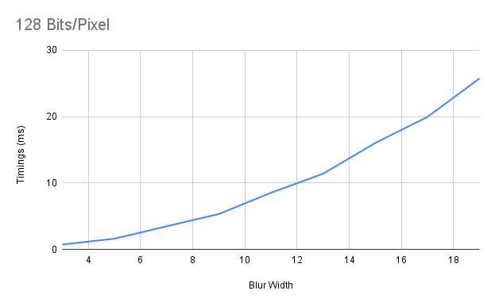

## Separation Anxiety

The simplest and most effective optimizations we're going to look at is to consider if our blur is actually separable.

The idea behind a separable blur is simple. We simply want to see if we can take our `NxN` blur and instead run it as two `N` blurs in sequence.

As an example, lets say we have a grid

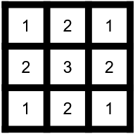

If we were to blur the center sample using a 3x3 kernel with weights of 1/9 (i.e. a box blur)

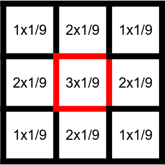

Then the resulting value at our center would be `1.66666666666`.

`(1+2+1+2+3+2+1+2+1)*1/9=1.66666666666`

However!

Our box blur is separable!

We can actually represent our box blur as two separate `3x1` blurs.

A first horizontal blur (focusing on the central column)

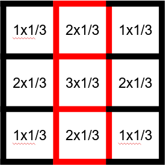

Which will give us these new values

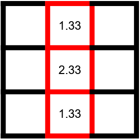

Which we then combine using a `3x1` vertical blur

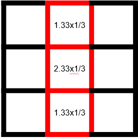

Which finally gives us `1.66666666666`!

```
Row0 = (1+2+1)*1/3=1.33333
Row1 = (2+3+2)*1/3=2.33333
Row2 = (1+2+1)*1/3=1.33333
Center = (Row0+Row1+Row2)*1/3
Center = (1.33+2.33+1.33)*1/3=1.66666666666
```

To implement this in your rendering pipeline you would simply:

- Run a horizontal 3x1 blur on your source texture
- Save the result to an intermediate texture
- Run a vertical 3x1 blur on that intermediate texture
- Save the result to your final texture

### Benefits

This optimization has some key benefits:

- You only run `2N` samples per-pixel instead of `NxN`. This means that your computational cost should grow linearly instead of quadratically.
- It's relatively simple to implement! You may end up having to change very little shader code (With our baseline example, we don't need to modify any shader code at all)

### Downsides

There are, of course, some downsides:

- You have to store an intermediate texture for the result of your first pass. If your tight on memory, it may be worthwhile to explore an inline version of this shader.
- You have an execution dependency between both passes and you'll need to run two blur kernels, this will introduce some overhead. Especially for small blur kernels where seperating them may not provide a substantial performance boost.

### Results!

Enough talking, lets see some results!

|Blur Width|Baseline |Separable|
|----------|---------|---------|
|3         |0.743631 |0.82328  |
|5         |1.621684 |0.894725 |
|7         |3.482308 |1.018965 |
|9         |5.335005 |1.190296 |
|11        |8.52493  |1.470615 |
|13        |11.395383|1.68044  |
|15        |16.026533|1.97353  |
|17        |19.945559|2.19047  |
|19        |25.743764|2.48294  |

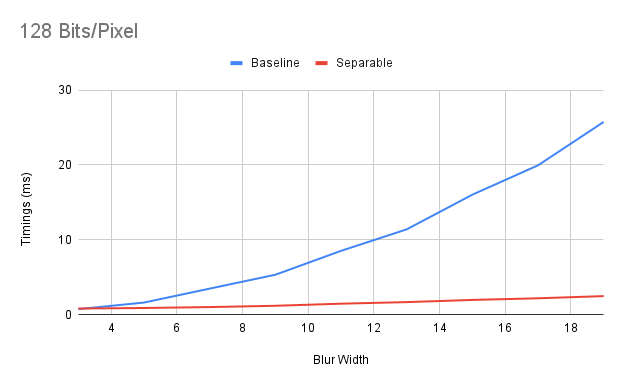

As you can see, our separable blur quickly outperforms our original `NxN` shader. (By over a whopping 20ms for a blur of `19x19`!).

Additionally, this graph clearly outlines the quadratic nature of our `NxN` blur and the linear nature of our separable version.

And finally, you can see that with a tiny `3x3` blur, our `NxN` shader is actually _faster_ due to the overhead of our multiple passes.

## But Can We Share?

Something you might observe if you investigate the behaviour of your blur, is that you might notice that each texel actually does quite a bit of sharing with its neighbours!

Lets look at an example.

If we look at the first row of our example grid, we can see that we have multiple overlapping blurs.


Out of the 6 total values we're using in this row, 4 are shared!

This suggests that our compute shader will actually share a large portion of its samples with its neighbours. If we were able to capitalize on this sharing, we could potentially gain some performance by avoiding some redundant memory loads between threads!

The idea for this optimization is relatively simple.

We want to load a whole row of values before doing our blur on those values.

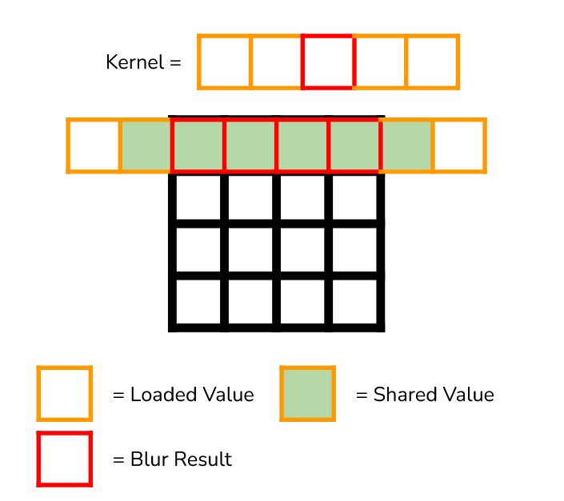

A row of values used by a threadgroup in our shader is simply the width of our threadgroup + two of our blur radius worth of values.

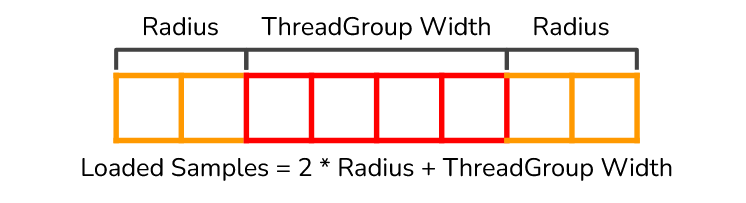

To load these rows, we simply have our threadgroup "sweep" accross our row to load all the values we need:

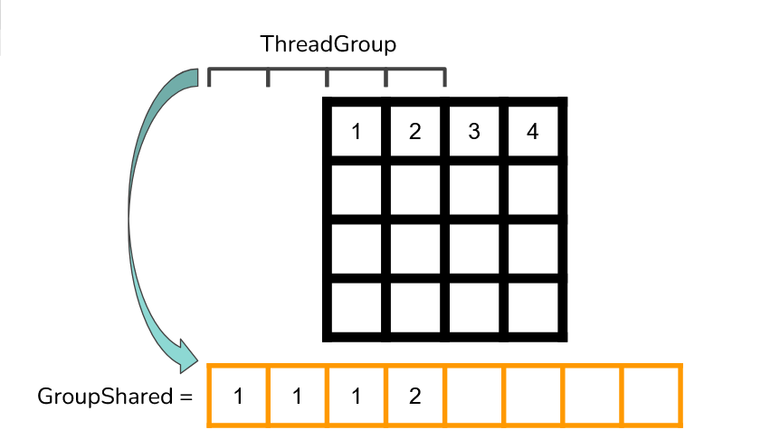

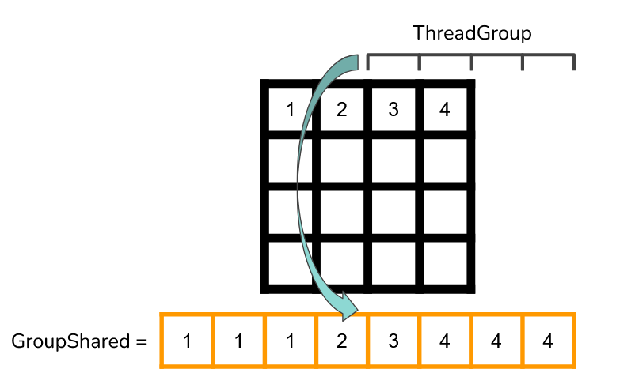

A horizontal version of that loading can look like this:

```
static uint const MaxCacheWidth = BlurThreadGroupWidth + MaxBlurRadius * 2; // Groupshared needs a maximum size
groupshared float4 TexelCache[MaxCacheWidth * BlurThreadGroupHeight];

void loadGroupSharedCache(uint2 threadGroupId, uint2 threadGroupOrigin)
{
	uint blurRadius = BlurConstants.BlurRadius;

    // Offset our starting position by the samples that we loaded at the edge
	int2 loadOrigin = (int2)threadGroupOrigin-int2(blurRadius, 0);
	uint loadWidth = (BlurThreadGroupWidth + blurRadius * 2);
	for(uint i = 0; i < loadWidth; i += BlurThreadGroupWidth)
	{
		uint2 cacheIndex2D = threadGroupId + uint2(i, 0);
		bool writeValid = cacheIndex2D.x < loadWidth;

		[branch]
		if(writeValid)
		{
			int2 readIndex = loadOrigin + (int2)cacheIndex2D;
			readIndex = clamp(readIndex,
				int2(0,0), int2(BlurConstants.SourceWidth-1, BlurConstants.SourceHeight-1));

			uint cacheIndex = cacheIndex2D.x * BlurThreadGroupWidth + cacheIndex2D.y;
			TexelCache[cacheIndex] = Source[readIndex];
		}
	}
}
```

Then, instead of reading from our texture in our blur loop, we simply read from groupshared.

```
// Offset our starting position by the samples that we loaded at the edge
int2 readIndex = int2(threadGroupId.xy) + int2(BlurConstants.BlurRadius, 0);
for(uint i = 0; i < BlurConstants.SampleCount; i++)
{
    int2 cacheIndex2D = readIndex + SimpleSamples[i].Offset;
    uint cacheIndex = cacheIndex2D.x * BlurThreadGroupWidth + cacheIndex2D.y;
    blur += Texel1DCache[cacheIndex] * SimpleSamples[i].Weight;
}
```

### Benefits

- Reduces the amount of memory loads needed for our blurs. Works best for textures that have large bits per-pixel. (Largest gains observed at 128bpp)

### Downsides

- Code complexity goes up pretty substantially.
- Not necessarily a win when your texture has small bits per-pixel. You're betting on beating your cache here. Should profile for your use case.
- Groupshared usage can become an occupancy limiter, causing your wave occupancy to completely ruin your potential performance benefits from the reduced memory usage.
- Small blur radii will not benefit much (or at all) from this optimization since there's minimal sharing and the likelihood that your values are already in cache is high.

### Results!

At 128 bits per pixel, we see some pretty notable gains as we get to larger blur radii

|Blur Width|Baseline |Separable|Separable GS|
|----------|---------|---------|------------|
|3         |0.744581 |0.823921 |1.024737    |
|5         |1.618009 |0.89465  |1.088424    |
|7         |3.494337 |1.022361 |1.138952    |
|9         |5.339948 |1.190535 |1.181699    |
|11        |8.531198 |1.468928 |1.30515     |
|13        |11.406805|1.685162 |1.453065    |
|15        |16.068599|1.978939 |1.591545    |
|17        |20.050658|2.199567 |1.71825     |
|19        |25.845276|2.500237 |1.874632    |

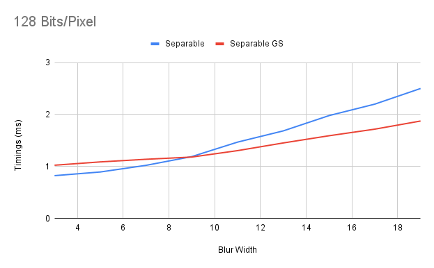

(Removed baseline `NxN` since it obscures the results by being sooooo slowwwwww)

At 32 bits per pixel, the picture looks quite a bit different

|Blur Width|Baseline |Separable|Separable GS|
|----------|---------|---------|------------|
|3         |0.384534 |0.423505 |0.63749     |
|5         |0.876196 |0.464511 |0.645974    |
|7         |1.673333 |0.591145 |0.702051    |
|9         |2.739451 |0.69224  |0.781162    |
|11        |4.094507 |0.823114 |0.905879    |
|13        |5.704834 |0.950053 |1.031964    |
|15        |7.592824 |1.093117 |1.161989    |
|17        |9.76564  |1.221598 |1.291576    |
|19        |12.218537|1.358348 |1.424937    |

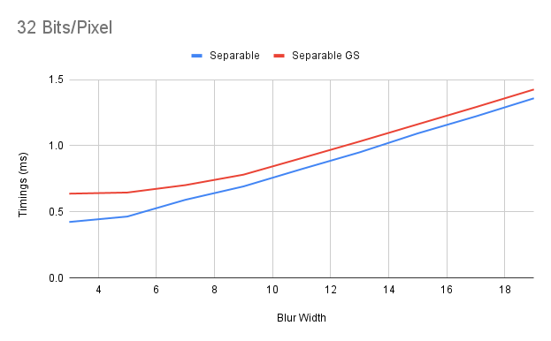

As you can see, our groupshared usage is just overhead and it doesn't seem like we'll catch up to our simple separable blur anytime soon.

### Implementation Guidelines

To reduce your groupshared pressure, instead of dispatching a symmetrical `NxN` threagroup, consider dispatching an assymetrical `NxM` threadgroup.

Since we only need extra space at the edges of our one dimensional threadgroup


Groupshared usage grows by `M` for each extra thread along our X axis but it grows by `N + 2 * Radius` for every extra thread along our Y axis.

As an example, if we have a 16x16 threadgroup and a MaxRadius of 8, our baseline groupshared size will be `(16+8*2)*16=512`.

Adding an extra thread along the X axis will give us a groupshared size of `(17+8*2)*16=528`.

However, adding an extra thread along the Y axis will give us a groupshared size of `(16+8*2)*17=544`!

For my use case on an RTX 3070 Ti, I found that a threadgroup size of `256x1` provided the best performance results but your mileage may vary.

### What About 2D?

As a small bonus, here are some of our statistics if you use groupshared to reduce your 2D shared sample overhead.

#### 32 Bits/Pixel

|Width|2D       |2D GS   |
|-----|---------|--------|
|3    |0.384534 |0.495603|
|5    |0.876196 |0.800146|
|7    |1.673333 |1.3197  |
|9    |2.739451 |2.029441|
|11   |4.094507 |2.908494|
|13   |5.704834 |3.962525|
|15   |7.592824 |5.222837|
|17   |9.76564  |6.633407|
|19   |12.218537|8.354483|

#### 128 Bits/Pixel

|Width|2D       |2D GS   |
|-----|---------|--------|
|3    |0.732132 |1.312892|
|5    |1.634236 |1.722673|
|7    |3.479287 |2.731621|
|9    |5.315822 |3.8853  |
|11   |8.482962 |5.549286|
|13   |11.364633|7.392646|
|15   |16.04207 |9.651219|
|17   |20.162963|12.09669|
|19   |25.694907|15.50847|

## Inline Separable Blurs

Despite its numerous advantages, a side effect you may run into with a two pass separable filter is the overhead from having to write back to global memory overshadows the benefits of doing less work overall.

One approach you can explore, is to separate your blur kernel within itself and to use groupshared memory as your intermediate buffer.

Lets look at a 3x3 separable filter as an example.

If we start with the second pass, we see that we apply a vertical filter that uses the results of 3 of our previous horizontal filters.

Vertical Pass:

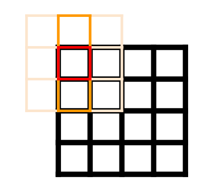

Source Horizontal Pass:

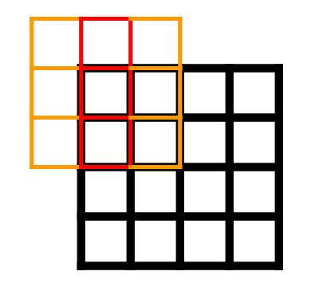

What we can observe, is that we simply need to store the results of the horizontal filter that we'll use in our vertical pass as part of our groupshared memory.

The code to write this is unfortunately fairly complicated - so we'll simply write it out in pseudo code here.;

```
groupshared float HorizontalPassResults[CacheSize];

void blurCS()
{
	HorizontalPassResults = doHorizontalBlur(SourceTexture);
	GroupMemoryBarrierWithGroupSync();
	OutputTexture = doVerticalBlur(HorizontalPassResults);
}
```

There's a few implementation choices here.

You could implement your horizontal blur as a groupshared 1D blur, which means that we need additional groupshared memory.

Or we could implement it as a simple 1D blur without any groupshared memory usage.

At this stage, you may start running into a variety of tradeoffs.

If we decide to use groupshared memory for our horizontal pass, our groupshared pressure grows pretty dramatically, potentially limiting our occupancy, reducing our overall performance.

However, if we decide to avoid using groupshared memory, we start running into potential memory bandwidth issues from our increased memory pressure since we're not using groupshared memory to share our memory loads between threads.

In my profiling, avoiding using groupshared memory in the horizontal pass allows us to avoid over subscribing to groupshared memory which has a dramatic impact on our occupancy and as a result our performance.

Here are the results without using groupshared in our horizontal pass compared to our groupshared separable filter and our 2D filter at 128 bits per pixel.

|Width|2D       |Separable GS|Inline Separable|
|-----|---------|------------|----------------|
|3    |0.735148 |1.025647    |0.636752        |
|5    |1.62365  |1.094989    |0.743439        |
|7    |3.527865 |1.138704    |0.864819        |
|9    |5.391209 |1.184832    |1.106415        |
|11   |8.637562 |1.309818    |1.322269        |
|13   |11.549441|1.453382    |1.628811        |
|15   |16.304226|1.594083    |1.818722        |
|17   |20.257372|1.717389    |2.070729        |
|19   |26.159442|1.882339    |2.351704        |

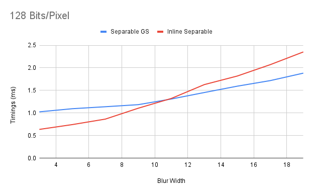

Here are the results with groupshared for our horizontal pass.

|Width|2D       |Separable GS|Inline Separable GS|
|-----|---------|------------|-------------------|
|3    |0.735148 |1.025647    |1.45678            |
|5    |1.62365  |1.094989    |1.619394           |
|7    |3.527865 |1.138704    |1.860834           |
|9    |5.391209 |1.184832    |2.171378           |
|11   |8.637562 |1.309818    |2.483697           |
|13   |11.549441|1.453382    |2.776213           |
|15   |16.304226|1.594083    |3.078972           |
|17   |20.257372|1.717389    |3.415786           |
|19   |26.159442|1.882339    |4.849435           |

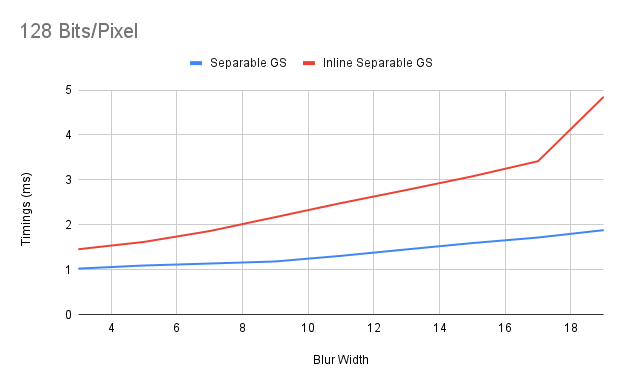

As you can see, when we attempt to also make use of groupshared memory for our horizontal pass, we end up with substantially lower performance than our baseline pass with our use case.

The primary cause of this performance regression is due to our substantial groupshared memory usage which has a severe impact on our occupancy.

If you're willing to store your intermediate values in groupshared at reduced precision (half precision or even 8 bits) in order to reduce the size of your intermediate cache, then you can likely improve these results.

## Conclusion

As you can see, figuring out if your blur is separable can net you some excellent savings for very little work!

You can then extend that idea using groupshared memory to reduce your overall memory pressure. However, as we saw, its not necessarily a clear win if your data and situation can't benefit from this optimization.

In the next part of this series, we'll be touching on the most complex of our blurs. The sliding window blur and its hyper-complex form, the inline sliding window blur.

See you next time!

## References

[1] [Optimizing GPU occupancy and resource usage with large thread groups](https://gpuopen.com/learn/optimizing-gpu-occupancy-resource-usage-large-thread-groups/)