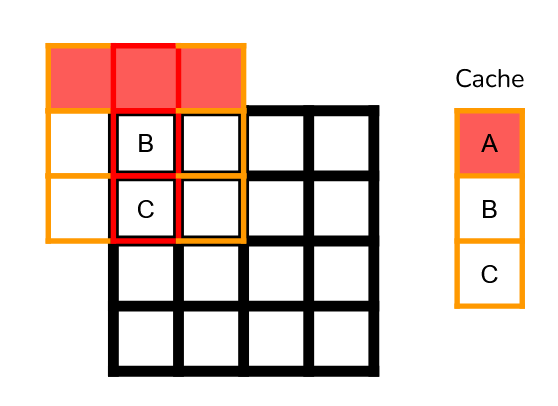

# A Tale Of Too Many Blurs (3/?) - Sliding Window


In our previous [post](ATaleOfTooManyBlurs_Part2_SeparableKernels.md) - we explored separating our blur kernals instead of doing an `NxN` blur we did an `N+N` blur.

Additionally, we touched on using groupshared memory to reduce our overall memory pressure at the potential cost of some of our occupancy.

In this post, we're going to explore an extension of our separable blur as well as the inline separable blur we introduced in the previous post.

I've observed this blur variant to have consistently high performance characteristics accross a variety of scenarios at the cost of some pretty high code complecity.

This algorithm is not my design - I'm simply describing it in a way that I think I would have found helpful when originally implementing it.

Credit goes to Jordan Logan and Timothy Lottes for presenting the core idea [\[link\]](https://gpuopen.com/gdc-presentations/2019/gdc-2019-s5-blend-of-gcn-optimization-and-color-processing.pdf) that I'm presenting here and Sebastian Aaltonen for describing it on twitter which originally brought the technique to my attention.

Lets jump in!

## The Sliding Window

Lets loop back to our original one dimensional blur with sharing through groupshared.


This sharing works really well.

But there's a flaw.

What about the boundaries between threadgroups.

Let's imagine that we have 2x1 threadgroups.


Where red is our first threadgroup and blue is our second threadgroup.


As you can see above, we're actually doing redundant loads across our threadgroups!

One way we can explore resolving this is by implementing a sliding window.

Instead of spawning `X` threadgroups to span the whole of your texture, you would spawn a single threadgroup per-column and this threadgroup would slide from left to right to process your whole texture while using groupshared memory as your intermediate buffer.

So you would start by filling up groupshared with the memory you need for a single invocation of your blur.


You would then work with groupshared to process your blur.


Then you would reload `ThreadGroup` number of elements into groupshared. Evicting the previous values that you won't use anymore.


And you would blur using those values!


Of course, groupshared can't grow like that.

Instead, you can implement your groupshared buffer as a ring buffer.


And finally, you scan your threadgroup across the whole texture width!


With this scheme, our one dimensional blur has no wasted texture loads.

But we run into an issue.

Spawning enough threads to hide our remaining texture load latency!

Sebastian Aaltonen went into excellent detail here on how you want to maximize your occupancy, but Twitter is not being particularly friendly to my lack of a Twitter account so I'm going to work through it here again.

If you decide to spawn a square threadgroup of 16x16, then you can easily calculate the number of threads you can spawn for a 4K texture as:

```
TotalThreadCount = ThreadgroupCount * ThreadGroupThreadCount

ThreadgroupCount = TextureHeight/ThreadGroupHeight
ThreadgroupCount = 4096/16
ThreadgroupCount = 256

TotalThreadCount = 256 * 16 * 16
TotalThreadCount = 65536
```

If we look at the Xbox Series X, we have 52 available Compute Unit, each compute unit can track 64 wave32s at once for a total of 106,496 threads in flight.

More threads than what we're spawning!

What you can do instead, is use an asymmetrical threadgroup size.

If we break down the algebra of our total thread count we see that

```
TotalThreadCount = ThreadgroupCount * ThreadGroupThreadWidth * ThreadGroupHeight
ThreadgroupCount = TextureHeight / ThreadGroupHeight

TotalThreadCount = TextureHeight / ThreadGroupHeight * ThreadGroupThreadWidth * ThreadGroupHeight

TotalThreadCount = TextureHeight * ThreadGroupThreadWidth
```

As we can see, our total thread count is entirely dependent on our threadgroup width!

So what we can do is shrink our threadgroup height and lengthen our threadgroup width.

Experimentally, `256x2` provided the best results on my GPU.

A `256x2` threadgroup gives us a total of `4096 * 256 = 1,048,576` threads!

A substantially higher utilization of our GPU and higher performance to boot!

Lets take a look at some numbers.

### Results!

With a threadgroup of `256x2`:

|Width|2D       |Separable|Separable GS|Sliding Window|
|-----|---------|---------|------------|--------------|
|3    |0.735148 |0.821471 |1.013779    |0.957298      |
|5    |1.62365  |0.901881 |1.108324    |1.023394      |
|7    |3.527865 |1.02799  |1.154124    |1.086498      |
|9    |5.391209 |1.214321 |1.200699    |1.168042      |
|11   |8.637562 |1.492953 |1.323388    |1.226717      |
|13   |11.549441|1.702914 |1.466267    |1.300704      |
|15   |16.304226|1.993194 |1.61179     |1.38043       |
|17   |20.257372|2.233709 |1.728423    |1.532896      |
|19   |26.159442|2.549869 |1.901066    |1.647792      |


As you can see, we consistently beat our groupshared separable variant!

Whereas, if we use a threadgroup size of `16x16` we get:

|Width|2D       |Separable|Separable GS|Sliding Window|
|-----|---------|---------|------------|--------------|
|3    |0.735148 |0.821471 |1.013779    |1.083223      |
|5    |1.62365  |0.901881 |1.108324    |1.194497      |
|7    |3.527865 |1.02799  |1.154124    |1.270294      |
|9    |5.391209 |1.214321 |1.200699    |1.41244       |
|11   |8.637562 |1.492953 |1.323388    |1.547291      |
|13   |11.549441|1.702914 |1.466267    |1.764806      |
|15   |16.304226|1.993194 |1.61179     |1.91566       |
|17   |20.257372|2.233709 |1.728423    |2.149695      |
|19   |26.159442|2.549869 |1.901066    |2.328058      |


We always lose to our groupshared variant...

It aint easy being a graphics programmer!

### What if I don't have a 4k texture?

If you don't have a 4k texture, you may not need all these blur variants at all!

But if you want to try anyways, with a threadgroup size of `256x2` and a texture size of `1024x1024` we would get an overall thread count of `256 * 1024 = 262,144` which is still decent, but if you want to explore alternatives, you can explore spawning multiple "columns".


These columns will double your threadcount at the cost of some extra redundant texture loads at the edges between each column.

(This idea will reappear later)

## Can we do better?

YES!

At this point - things are pretty darn fast.

But one of our bottlenecks is the write back to global memory in order to run the second pass on our one dimensional blur.

What we can do, is we can use the same ideas we presented in the inline separable filter in the previous post.

Instead of having our sliding window blur horizontally and then blur vertically, we would run a horizontal pass within our threadgroup and cache those results into our vertical sliding window buffer.

First we do oa horizontal blur for each element that we need and store it in our groupshared cache.


And then we blur it vertically!


Finally, we evict our unneeded rows and calculate our next horizontal blurs and repeat the process!




### Implementation Guidelines

#### Groupshared Horizontal Cache

For your horizontal pass, you can use groupshared memory to reduce the amount of memory you're loading across your threads. Following the approach we saw in our separable groupshared shader.

However, you run into the risk of over subscribing to groupshared memory which will reduce your overall occupancy and as a result negatively impact your performance.

In this case there's a few options you can consider:

- Don't use groupshared memory for your horizontal pass.
- Store your results as halfs instead of as floats.

#### Limited Threads In-flight

Similarly to our discussion above on the separable sliding window blur, you may not have enough threads in flight to fully hide your occupancy and maximize parallelism.

You can follow the same idea described above with this implementation as well.

Spawn a series of vertical groups instead of having a single group run across the whole texture. In my experimentation, for a 2k texture, 8 groups provided the best results.

### Results!

If we look at a variant where we don't make use of groupshared memory for our horizontal blurs, we have a pretty substantial advantage over our original sliding window implementation until our memory pressure from our horizontal memory loads catch up to us.


|Width|2D       |Separable|Sliding Window|Inline Sliding Window|
|-----|---------|---------|--------------|---------------------|
|3    |0.735148 |0.821471 |0.957298      |0.558391             |
|5    |1.62365  |0.901881 |1.023394      |0.687429             |
|7    |3.527865 |1.02799  |1.086498      |0.763222             |
|9    |5.391209 |1.214321 |1.168042      |0.979133             |
|11   |8.637562 |1.492953 |1.226717      |1.099264             |
|13   |11.549441|1.702914 |1.300704      |1.318707             |
|15   |16.304226|1.993194 |1.38043       |1.427177             |
|17   |20.257372|2.233709 |1.532896      |1.646994             |
|19   |26.159442|2.549869 |1.647792      |1.748748             |

If we try to make use of groupshared memory to cache our horizontal loads, we run into a bit of a problem...


It's frequently slower!

## What About Using Halfs?

Across all of these implementations that make use of groupshared memory, we've used 32 bit precision floating point as our storage format for our groupshared memory.

This can cause our occupancy to be substantially reduced since we may end up running out of groupshared memory before we can schedule enough threadgroups to saturate our GPU.

What if we use halfs for our groupshared storage instead?

This means that we're going to trade some performance for accuracy in our kernel.

This may be a tradeoff you're willing to make!

The results may definitely be worth it.


|2D |Separable|Sliding Window|Inline Sliding Window|Inline Sliding Window Horizontal GS|
|---|---------|--------------|---------------------|-----------------------------------|
|0.735148|0.821471 |0.95507       |0.56043              |0.560252                           |
|1.62365|0.901881 |1.019913      |0.664463             |0.614856                           |
|3.527865|1.02799  |1.086602      |0.737345             |0.692119                           |
|5.391209|1.214321 |1.175109      |0.966387             |0.824544                           |
|8.637562|1.492953 |1.240839      |1.057926             |0.927536                           |
|11.549441|1.702914 |1.327034      |1.29001              |1.074878                           |
|16.304226|1.993194 |1.435602      |1.38181              |1.177938                           |
|20.257372|2.233709 |1.603783      |1.625542             |1.325587                           |
|26.159442|2.549869 |1.721762      |1.718722             |1.477609                           |

Our inline sliding window with groupshared caching for our horizontal pass now consistently beats all of our other blurs!

## Conclusion

Alright! I think this is where I'm going to wrap it up.

I intended to touch on the benefits of packing your sample offset information (store your weights as halves and pack your offsets) as well as what type of storage to use to store your offsets (use constant buffers if you can, they're consistently fast) but I think I'm done with this series.

Some sample shaders have been provided for further reference.

- [Sliding Window Blur](ATaleOfTooManyBlurs_Shaders/sample_blur_1d_sliding_window.hlsl)
- [Inline Sliding Window Blur](ATaleOfTooManyBlurs_Shaders/sample_blur_inline_sliding_window.hlsl)

Hopefully this was as insightful for you as it was for me!

## Appendices

### Appendix A - A Thorough Breakdown Of Our Results

Lets look at our results across a variety of texture resolutions and bits per-pixel.

We're going to compare our performance using the `half`-based groupshared storage since I think that's the most practical one.

#### 512x512


#### 1024x1024


#### 2048x2048


#### 4096x4096


### Appendix B - Stable Profiling

By the end of writting this post, I ran into behaviour where my profiling results would start varying in surprising ways.

It would start being dramatically faster for a larger blur width or having large spikes in slow downs.

I subsequently ran into this repository that utilizes DX12's `SetStablePowerState` in order to stabilize results.

https://github.com/LouisBavoil/SetStablePowerState

If you find yourself profiling on PC, it might be worthwhile to explore using this or a similar utility to stabilize your GPU profiling results.

## References

[1] [A Blend Of GCN Optimization And Color Processing](https://gpuopen.com/gdc-presentations/2019/gdc-2019-s5-blend-of-gcn-optimization-and-color-processing.pdf)

[2] [RDNA White Paper](https://www.amd.com/system/files/documents/rdna-whitepaper.pdf)