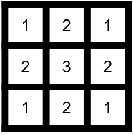
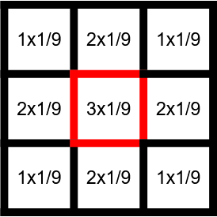
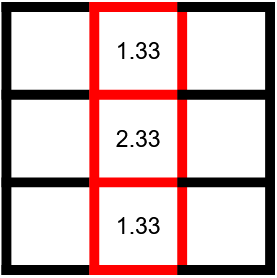
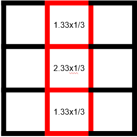
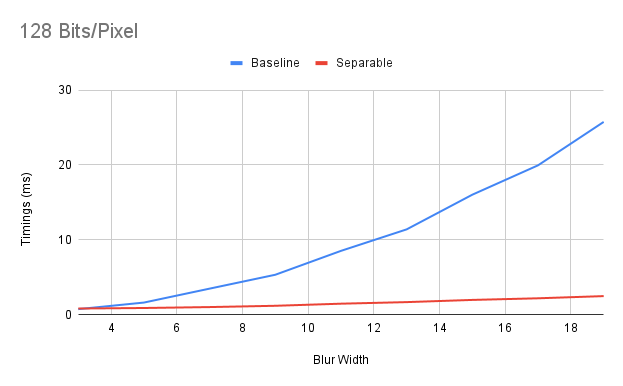

# A Tale Of Too Many Blurs (2/?) - 


In our previous [post](ATaleOfTooManyBlurs_ZCurves.md) - we explored a simple 3x3 fixed blur kernel.

In this post, we're going to explore some approaches to optimizing a variable sized blur kernel.

As a reminder, all of these blurs are run on a 4096x4096 texture running on an RTX 3070 Ti.

## Speedrunning Variable NxN shaders

Since the goal of this post isn't to show you _how_ to implement a blur shader but simply to highlight various optimizations you can attempt, we'll speedrun the modifications to our shader.

For our use case, we'll simply start with a `StructuredBuffer` of `M` samples and iterate through those.

```
struct SimpleSample
{
	int2 Offset;
	float Weight;
};

StructuredBuffer<SimpleSample> SimpleSamples;
```

```
// Key blur loop
float4 blur = 0.0f;
for(uint i = 0; i < BlurConstants.SampleCount; i++)
{
    int2 readIndex = clamp((int2)dispatchId.xy + SimpleSamples[i].Offset,
        int2(0, 0), int2(BlurConstants.SourceWidth - 1, BlurConstants.SourceHeight - 1));
    blur += Source[readIndex] * SimpleSamples[i].Weight;
}
```

And that's it for our base changes.

Our baseline timings are:

|Blur Width|Baseline |
|----------|---------|
|3         |0.743631 |
|5         |1.621684 |
|7         |3.482308 |
|9         |5.335005 |
|11        |8.52493  |
|13        |11.395383|
|15        |16.026533|
|17        |19.945559|
|19        |25.743764|


## Separation Anxiety

The simplest and most effective optimizations we're going to look at is to consider if our blur is actually separable.

The idea behind a separable blur is simple. We simply want to see if we can take our `NxN` blur and instead run it as two `N` blurs in sequence.

As an example, lets say we have a grid



If we were to blur the center sample using a 3x3 kernel with weights of 1/9 (i.e. a box blur)



Then the resulting value at our center would be `1.66666666666`.

`(1+2+1+2+3+2+1+2+1)*1/9=1.66666666666`

However!

Our box blur is separable!

We can actually represent our box blur as two separate `3x1` blurs.

A first horizontal blur (focusing on the central column)


Which will give us these new values



Which we then combine using a `3x1` vertical blur



Which finally gives us `1.66666666666`!

```
Row0 = (1+2+1)*1/3=1.33333
Row1 = (2+3+2)*1/3=2.33333
Row2 = (1+2+1)*1/3=1.33333
Center = (Row0+Row1+Row2)*1/3
Center = (1.33+2.33+1.33)*1/3=1.66666666666
```

To implement this in your rendering pipeline you would simply:

- Run a horizontal 3x1 blur on your source texture
- Save the result to an intermediate texture
- Run a vertical 3x1 blur on that intermediate texture
- Save the result to your final texture

### Benefits

This optimization has some key benefits:

- You only run `2N` samples per-pixel instead of `NxN`. This means that your computational cost should grow linearly instead of quadratically.
- It's relatively simple to implement! You may end up having to change very little shader code (With our baseline example, we don't need to modify any shader code at all)

### Downsides

There are, of course, some downsides:

- You have to store an intermediate texture for the result of your first pass. If your tight on memory, it may be worthwhile to explore an inline version of this shader.
- You have an execution dependency between both passes and you'll need to run two blur kernels, this will introduce some overhead. Especially for small blur kernels where seperating them may not provide a substantial performance boost.

### Results!

Enough talking, lets see some results!

|Blur Width|Baseline |Separable|
|----------|---------|---------|
|3         |0.743631 |0.82328  |
|5         |1.621684 |0.894725 |
|7         |3.482308 |1.018965 |
|9         |5.335005 |1.190296 |
|11        |8.52493  |1.470615 |
|13        |11.395383|1.68044  |
|15        |16.026533|1.97353  |
|17        |19.945559|2.19047  |
|19        |25.743764|2.48294  |



As you can see, our separable blur quickly outperforms our original `NxN` shader. (By over a whopping 20ms for a blur of `19x19`!).

Additionally, this graph clearly outlines the quadratic nature of our `NxN` blur and the linear nature of our separable version.

And finally, you can see that with a tiny `3x3` blur, our `NxN` shader is actually _faster_ due to the overhead of our multiple passes.

## But Can We Share?

Something you might observe if you investigate the behaviour of your blur, is that you might notice that each texel actually does quite a bit of sharing with its neighbours!

TODO: Groupshared

## Conclusion

See you next time!

## Appendices

### Appendix A - Inline Separable Blurs

TODO: Inline separable

## References