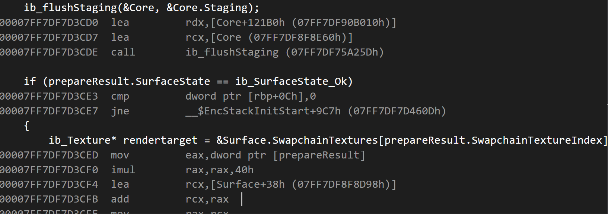
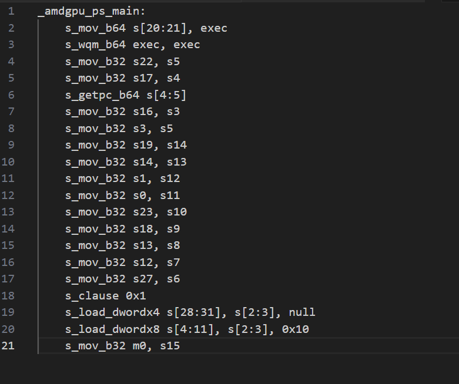
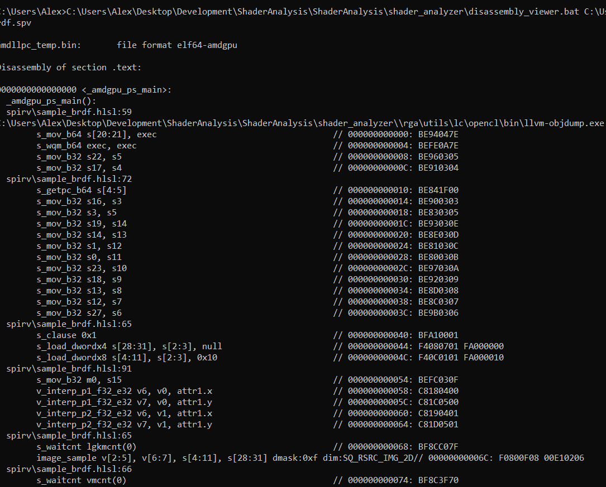

# Shader Dissassembly - But Better

This post will be relatively short. I'm creating it mostly as a reference!

## What's The Problem?

If you use RGA for AMD disassembly of your favourite graphics programming language, you may have run into the unfortunate discovery that it doesn't give you source file information like you will often see when viewing disassembly in a tool like visual studio for C/C++.



Instead, you might run into something like this:



No source file information!

You can derive what part of your code correlates with which parts of the disassembly.

But that's work.

And we don't like work.

Thankfully, there's a solution for this!

## What's The Solution?

Although I like storytelling, I'll give you the answer right away.

Instead of using `rga.exe`, invoke `amdllpc.exe` and `llvm-objdump.exe` directly.

When invoking `amdllpc.exe` make sure to include `-trim-debug-info=false`.

```
rga\utils\amdllpc.exe -v --include-llvm-ir --auto-layout-desc -o="amdllpc_temp.bin" --gfxip=10.3.0 -trim-debug-info=false myspirv.spv

rga\utils\lc\opencl\bin\llvm-objdump.exe --disassemble --symbolize-operands --line-numbers --source --triple=amdgcn--amdpal --mcpu=gfx1030 "amdllpc_temp.bin"
```

You can find an example batch file at https://github.com/AlexSabourinDev/shader_analyzer/blob/main/disassembly_viewer.bat.

## How Did We Get To The Solution?

If you want to read about how we got here, read on!

When we run RGA for offline vulkan and we add `-v` for verbose output we find out it runs these two processes:

```
Launching external process:
utils\amdllpc.exe -v --include-llvm-ir --auto-layout-desc --log-file-outs="C:\Users\Alex\AppData\Local\Temp\amdllpcTempFile.txt"  -o="C:\Users\Alex\AppData\Local\Temp\GPUOpen\rga\rga-temp-out30748.bin" --gfxip=10.3.0 "sample_brdf.spv"

Info: launching external process:
C:\Users\Alex\Desktop\Development\ShaderAnalysis\ShaderAnalysis\shader_analyzer\rga\utils\lc\disassembler\amdgpu-dis.exe "C:\Users\Alex\AppData\Local\Temp\GPUOpen\rga\rga-temp-out30748.bin"
```

`amdllpc.exe` is the offline shader compiler for the offline vulkan path and `amdgpu-dis.exe` takes the results of that compilation to create our disassembly file.

Thankfully, Leszek Godlewski ([@TheIneQuation](https://mastodon.gamedev.place/@TheIneQuation)) had opened up a [github issue](https://github.com/GPUOpen-Drivers/llpc/issues/513) on AMD's llpc repo that has all the information we need to solve this problem.

We need to run `amdllpc.exe` with `-trim-debug-info=false`!

However, if we manually run `amdllpc.exe` with `-trim-debug-info=false` and `amdgpu-dis.exe`, still no source information!

I ended up noticing that the OpenCL path in RGA correctly generated source line information and its RGA verbose output was completely different.

The key difference for our use case being that OpenCL uses `llvm-objdump.exe`.

When we try that, we get our source information!




(You may notice that Leszek uses `llvm-objdump.exe` to view the disassembly. I didn't notice that at the time...)

## Conclusions

That's the end for this short post.Hopefully this helps!

As an asice, I'm not sure why RGA uses `amdgpu-dis.exe` instead of `llvm-objdump.exe` but perhaps it will include source information as an optional parameter in the future!

