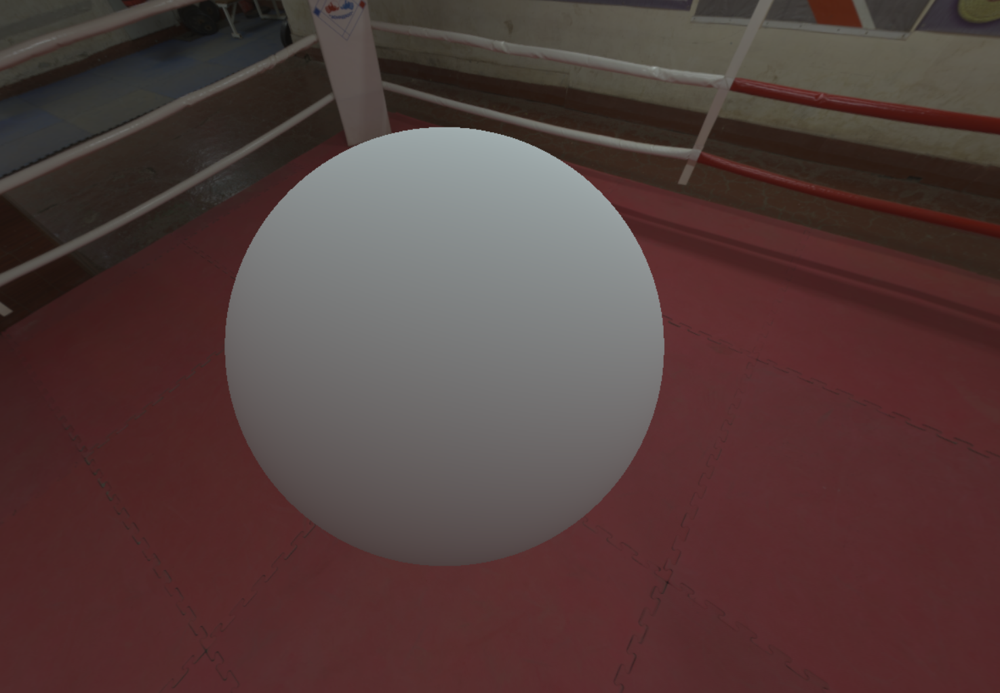
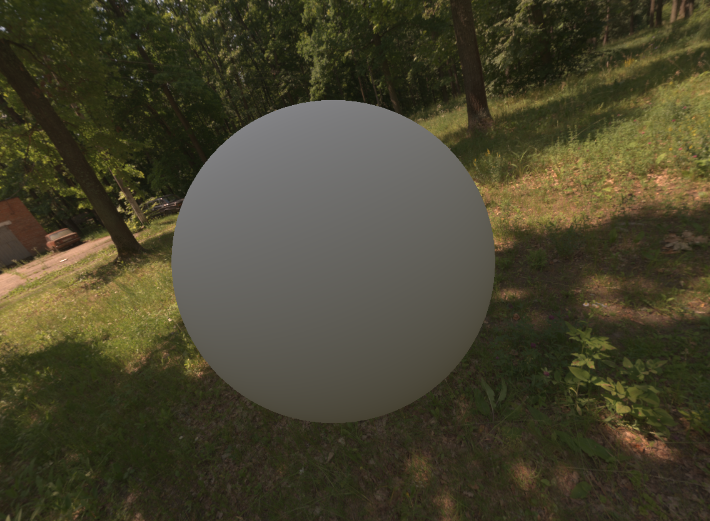
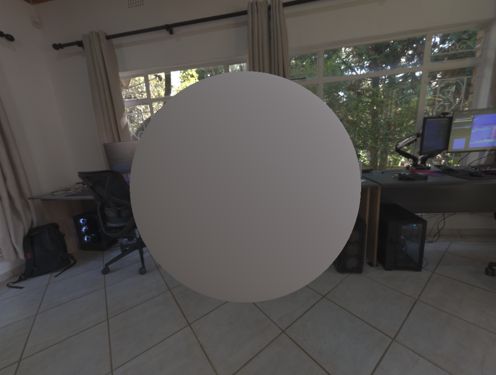

# Compressing Spherical Harmonic Data


## The Idea

Recently (within the last 12 months) I came accross a two part series from Graham Hazel ([@grahamhazel](https://twitter.com/grahamhazel)) about an alternative formulation for Spherical Harmonics.

- [Alternative definition of Spherical Harmonics for Lighting (Part 1)](https://grahamhazel.com/blog/2017/12/18/alternative-definition-of-spherical-harmonics-for-lighting/)
- [Converting SH Radiance to Irradiance (Part 2)](https://grahamhazel.com/blog/2017/12/22/converting-sh-radiance-to-irradiance/)

These posts gave me the idea: what if we used the insights provided in this document to compress our spherical harmonic coefficients?

We were able to go from 24 bytes to 16 with an experimentally observed Mean Squared Error of 0.000004 in our worst case tests as opposed to 0.000000042 for a baseline 16 bit floating point representation. (This MSE is calculated as the distance between two 3D points in RGB space)

This will be a brief post describing the choices and the implementation.

## The Groundwork

I recommend you read Graham's posts before moving forward with this document as they will provide the necessary foundation for the following discussion.

I provide some additional fundamentals about spherical harmonics here: [Spherical Harmonics - Insights And Fundamentals](https://github.com/AlexSabourinDev/cranberry_blog/blob/master/SphericalHarmonics_Fundamentals.md)

For this document, we will focus on the L1 representation of spherical harmonics. Following Graham's formulation, we shift our normalization constant $\frac{1}{\sqrt{4\pi}}$ from our basis into our coefficients.

This transforms our final evaluation for a coefficient vector $\vec{\boldsymbol{R}}$ from:

$$
y=\frac{1}{\sqrt{4\pi}}R_0+\frac{3}{\sqrt{4\pi}}\sum_{i=1}^{3}{R_i}
$$

To:

$$
y=R_0+\sum_{i=1}^{3}{3R_i}
$$

Graham notes:

> By construction, the length of $\vec{\boldsymbol{R}}_1$ will vary between zero and $R_0$, the first SH coefficient. The ratio $|\vec{\boldsymbol{R}}_1| / R_0$ is an indication of "how directional" the function is. If the ratio is one then R is completely directional - all of the energy is at a single point on the sphere. Conversely, if the ratio is zero then R is symmetrical, and the L1 band gives us no directional information at all.

And this is the key to our ability to compress our coefficients!

## Let's Compress Some Data!

First, some numbers.

A base, 32 bit floating point representation for full RGB L1 spherical harmonics would occupy 48 bytes or 384 bits. That's a lot of memory!

I will assume that you're likely compressing your data into 16 bit floats instead. Resulting in 24 bytes or 192 bits.

As noted above, the length of the vector representing our L1 coefficients is bound between 0 and $R_0$.

We can take our vector (which Graham denotes as $\vec{\boldsymbol{R}}_1$) and split it into two components $\vec{\boldsymbol{D}}$ and $L$ where $\vec{\boldsymbol{D}}$ is a normalized vector representing the direction of the energy and $L$ represents the amount of "directionality" of our data on a scale of 0 to $R_0$.

We can then break down our spherical harmonic coefficients into three terms.

- $R_0$ our first coefficient. This value is always positive.
- $\vec{\boldsymbol{D}}$ the normalized direction of our energy.
- $L$ the amount of "directionality". Ranges from 0 to $R_0$.

Unfortunately, I don't have a great way to compress $R_0$ so it will stay as a 16 bit float. We can _at least_ ignore our sign bit for a single bit (woo!).

$\vec{\boldsymbol{D}}$ is normalized. As a result, we can compress it using octahedral mapping. That takes us from three 16 bit floats to 2 `N` bit Unorms. (We will decide on `N` in a moment).

Additionally, since $L$ ranges from 0 to $R_0$ we can normalize it as $L^\prime=\frac{L}{R_0}$ and quantize it to `M` bits. $L$ only represents our energy's "directionality". I found that `M=8` was plenty of resolution for our use case.

We have:

- $R_0$ at 15 bits. (No sign bit)
- $\vec{\boldsymbol{D}}$ at $2N$ bits.
- $L^\prime$ at 8 bits.

That puts us at $23+2N$ bits.

With 3 components, our total compression would result in $3(23+2N)=69+6N$ bits. We ideally want to fit within a 32 bit boundary to faciliate loading our data. The closest 32 bit boundaries are 96 bits and 128 bits.

Aiming for 96 bits leaves 27 bits for our directionality or 4 bits per component which... isn't much!

At 128 bits, we get 9 bits which is substantially better!

128 bits allows us to fit our whole 3 channel coefficients into four 32 bit floats.

We do end up with 5 bits left over. Which you could redistribute wherever you think is appropriate!

I've seen marginal improvements to MSE by compressing $L^\prime$ to 9 bits instead of 8 at the cost of some decompression complexity due to fitting all our data in a series of `uint`.

## Lets See Some Code!

You can find some sample code in [SphericalHarmonicsCompression.hsh](SphericalHarmonics_Compression_Shaders/SphericalHarmonicsCompression.hsh)

But below we can see an implementation of the packing and unpacking functions:

```
// Full code in SphericalHarmonicsCompression.hsh

PackedColorSH packSH(ColorSH sh)
{
	float3 ambient = float3(sh.R.x, sh.G.x, sh.B.x);
	float3 dirR = sh.R.yzw;
	float3 dirG = sh.G.yzw;
	float3 dirB = sh.B.yzw;

	float3 scale = float3
	(
		length(dirR),
		length(dirG),
		length(dirB)
	);

	// We need to make sure we encode a valid direction.
	// The actual direction doesn't matter if scale is 0
	// Its going to be scaled down to 0 in the unpacking anyways.
	dirR = scale.r > 0.0f ? dirR / scale.r : float3(1.0f, 0.0f, 0.0f);
	dirG = scale.g > 0.0f ? dirG / scale.g : float3(1.0f, 0.0f, 0.0f);
	dirB = scale.b > 0.0f ? dirB / scale.b : float3(1.0f, 0.0f, 0.0f);

	uint2 octDirR = packUnorm(toOctahedral(dirR), 9);
	uint2 octDirG = packUnorm(toOctahedral(dirG), 9);
	uint2 octDirB = packUnorm(toOctahedral(dirB), 9);

	uint3 packedScale = packUnorm((scale / ambient), 8);

	// Can ignore sign bit, expected to be positive.
	uint halfAmbientR = f32tof16(max(ambient.r, 0.0f));
	uint halfAmbientG = f32tof16(max(ambient.g, 0.0f));
	uint halfAmbientB = f32tof16(max(ambient.b, 0.0f));

	PackedColorSH packed;

	// Bit format: 15 | 9 | 8
	packed.Data[0] = halfAmbientR | (octDirR.x << 15) | (packedScale.r << 24);
	packed.Data[1] = halfAmbientG | (octDirG.x << 15) | (packedScale.g << 24);
	packed.Data[2] = halfAmbientB | (octDirB.x << 15) | (packedScale.b << 24);
	packed.Data[3] = octDirR.y | (octDirG.y << 9) | (octDirB.y << 18); // 5 bits leftover

	return packed;
}

ColorSH unpackSH(PackedColorSH packed)
{
	uint3 packedScale = uint3(packed.Data[0] >> 24, packed.Data[1] >> 24, packed.Data[2] >> 24);
	uint halfAmbientR = packed.Data[0] & 0x7FFF;
	uint halfAmbientG = packed.Data[1] & 0x7FFF;
	uint halfAmbientB = packed.Data[2] & 0x7FFF;

	uint2 packedDirR = uint2((packed.Data[0] >> 15) & 0x1FF, packed.Data[3] & 0x1FF);
	uint2 packedDirG = uint2((packed.Data[1] >> 15) & 0x1FF, (packed.Data[3] >> 9) & 0x1FF);
	uint2 packedDirB = uint2((packed.Data[2] >> 15) & 0x1FF, (packed.Data[3] >> 18) & 0x1FF);

	float3 ambient = float3(f16tof32(halfAmbientR), f16tof32(halfAmbientG), f16tof32(halfAmbientB));
	float3 scale = ambient * unpackUnorm(packedScale, 8);

	float3 dirR = fromOctahedral(unpackUnorm(packedDirR, 9));
	float3 dirG = fromOctahedral(unpackUnorm(packedDirG, 9));
	float3 dirB = fromOctahedral(unpackUnorm(packedDirB, 9));

	ColorSH sh;
	sh.R = float4(ambient.x, dirR * scale.r);
	sh.G = float4(ambient.y, dirG * scale.g);
	sh.B = float4(ambient.z, dirB * scale.b);

	return sh;
}
```

## Results

I've included a few images showcasing the results.

The left of the sphere uses the uncompressed coefficients and the right uses the compressed coefficients.

You'll notice that there isn't any noticeable difference between both sides.








## Conclusion

And that's about it!

Keep in mind, this was mostly for my own entertainment and hasn't been tested in a production environment.

Hopefully it can give you some ideas!

## Appendix A - Average Direction

If you're willing to lose some additional quality but compress the data further, we can take the three directions for each color component and simply take their average.

This results in:

- 3 Ambient Terms at 15 bits
- 2 Octohedral components at N bits
- 3 Scale components at 8 bits

Our next 32 bit boundary is 96 bits. We have $45+24+2N=96$ leaves us with 13 bits for our average direction's octahedral components!

With that, our worst case MSE becomes 0.001004 for 96 bits.

Below I've included my test C code for reference on the implementation:

```
cv3 avgDir = cv3_normalize(cv3_mulf(cv3_add(cv3_add(dirR, dirG), dirB), 1.0f / 3.0f));
cv2 octDir = cv3_to_octahedral(avgDir);

uint32_t packedDir = cv2_packUnorm(octDir, 13);
uint32_t packedScaleR = cf_compress_unorm(scale.x / R0Term.x, 8);
uint32_t packedScaleG = cf_compress_unorm(scale.y / R0Term.y, 8);
uint32_t packedScaleB = cf_compress_unorm(scale.z / R0Term.z, 8);
ch3 halfR0 = cv3_f32_to_f16(R0Term);
```

Additionally, you can go even further by moving from a 3 component scale to a single average scale. Which drops us from 96 to 79 bits.

We need to save another 15 bits if we want to get to 64 bits.

Instead of 13 bits for our directional components, we can use 11 bits (saving 4 bits). Additionally, we can compress our $R_0$ term from 15 bit floats (we don't store the sign bit) to 11 bit floats (saving 12 bits).

With that, we reach 64 bits, the size of a double!

We get a pretty dramatic loss in quality though... rising to a worst case MSE of 0.019137!

```
cv3 avgDir = cv3_mulf(cv3_add(cv3_add(dirR, dirG), dirB), 1.0f / 3.0f);
float avgR0 = (R0Term.x + R0Term.y + R0Term.z) / 3.0f;
float avgScale = (scale.x + scale.y + scale.z) / 3.0f;
avgDir = cv3_normalize(avgDir);
cv2 octDir = cv3_to_octahedral(avgDir);
uint32_t packedDir = cv2_packUnorm(octDir, 11);

uint32_t packedScale = cf_compress_unorm(avgScale / avgR0, 8);
cu3 compressedR0 = (cu3)
{
    cf_compress_float_unsigned(R0Term.x, 5, 6),
    cf_compress_float_unsigned(R0Term.y, 5, 6),
    cf_compress_float_unsigned(R0Term.z, 5, 6),
};
```

## Appendix B - Yuv compression

Finally, the last idea I had was to compress our data from RGB to Yuv.

Conveniently, you can compress your RGB coefficients directly into Yuv spherical harmonic coefficients. See [This Paper](https://ttwong12.github.io/papers/plenwave/plenwave.pdf) for the derivation.

If we assume that we primarily care about luminance and disregard chromacity, we can assume that we don't care about the directionality of our `uv` coefficients.

We then compress our Yuv coefficients as:

- 16 bits for our Y $R_0$ term.
- 8 bits for our uv $R_0$ terms.
- 12 bits per octohedral components for Y $\vec{\boldsymbol{D}}$.
- 8 bits for Y $L^\prime$.

Putting us at 64 bits!

But with our worst MSE yet of 0.062917...


It's important to keep in mind that our MSE doesn't necessarily account for perceptual error. As a result, this _may_ look fine in some scenarios or it may look worse! Use at your own risk.

```
float scaleYUV = cv3_length(dirY);
dirY = cv3_normalize(dirY);

cv2 octDirY = cv3_to_octahedral(dirY);

uint32_t packedDir = cv2_packUnorm(octDirY, 12);
uint32_t packedScaleY = cf_compress_unorm(scaleYUV / r0TermYUV.x, 8);

cu3 compressedR0 = (cu3)
{
    cf_compress_float_unsigned(r0TermYUV.x, 5, 11),
    cf_compress_float_unsigned(r0TermYUV.y, 5, 3),
    cf_compress_float_unsigned(r0TermYUV.z, 5, 3),
};
```
