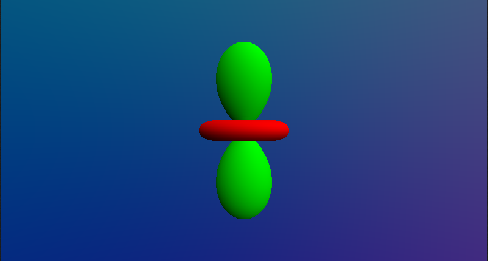

# Spherical Harmonics - Insights And Fundamentals

Recently, I have been doing some research about spherical harmonics for a monthly graphics round-table that we run at Snowed In Studios. In the process of solidifying my understanding of this peculiar tool, I figured it may be valuable to document the intuitions that I've developed in the process.

Before moving forward with the rest of this post, I will note that there are some truly excellent resources on spherical harmonics.

- [Spherical Harmonic Lighting: The Gritty Details](https://3dvar.com/Green2003Spherical.pdf) By Robin Green 
- [Spherical Harmonics](https://patapom.com/blog/SHPortal/) By Patapom
- [Stupid Spherical Harmonics (SH) Tricks](https://www.ppsloan.org/publications/StupidSH36.pdf) By Peter-Pike Sloan

For the interested reader, I would suggest perhaps reading these in the order presented here. I read them in the reverse order and suspect that it may have been easier the other way around.

Since these excellent resources are already available, I will use that as a bit of a shortcut to skip portions of the topic if I feel that my particular lens does not add any new insights/perspectives.

## The Fundamentals

### Basis Functions

As a quick whirlwind introduction, spherical harmonics can be viewed as a series of functions defined on the sphere with which we can construct any other function.

As an example, if we have a series of functions:

$$
b_0(x), b_1(x), b_2(x), ..., b_n(x)
$$

We could describe a target function $g(x)$ as a set of coefficients that we would apply to each function $c_0, c_1, c_2, ..., c_n$ 

$$
g(x) \approx c_0b_0(x) + c_1b_1(x) + c_2b_x(x) + ... + c_nb_n(x)
$$

These types of functions are known as basis functions.

Robin Green [1] has an excellent description of these, and as a result, I think it would be to both our benefits that we simply reiterate the excellent description and visuals:

> Basis functions are small pieces of signal that can be scaled and combined to produce an approximation to an original function, and the process of working out how much of each basis function to sum is called projection. To approximate a function using basis functions we must work out a scalar value that represents how much the original function $f(x)$ is like the each basis function $B_i(x)$. We do this by integrating the product $f(x)B_i(x)$
> over the full domain of $f$.
>
> 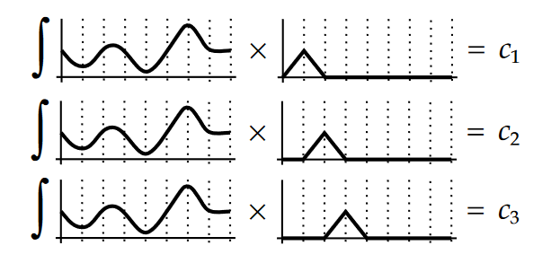
>
> Using this projection process over all our basis functions returns a vector of approximation coefficients. If we scale the corresponding basis function by the coefficients...
>
> 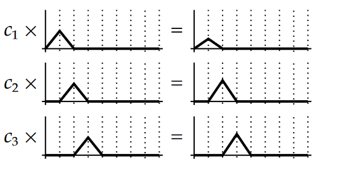
>
> ... and sum the results we obtain our approximated function.
>
> 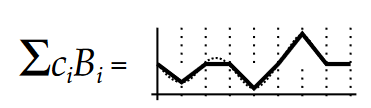

Spherical harmonics have the additional property that they form an orthogonal basis. This means that if we integrate the product of one function multiplied by any other function in the set for a particular input range $A, B$, the result will be 0.

$$
\int_A^B b_i(x)b_j(x)dx=0, i\neq j
$$

Additionally, the result of an integral of one of our functions multiplied by itself gives us some constant $c$.

$$
\int_A^B b_i(x)b_i(x)dx=c
$$

An example of a set of functions that meet these criteria are $sin(x)$ and $cos(x)$ in the range $0, \pi$. 

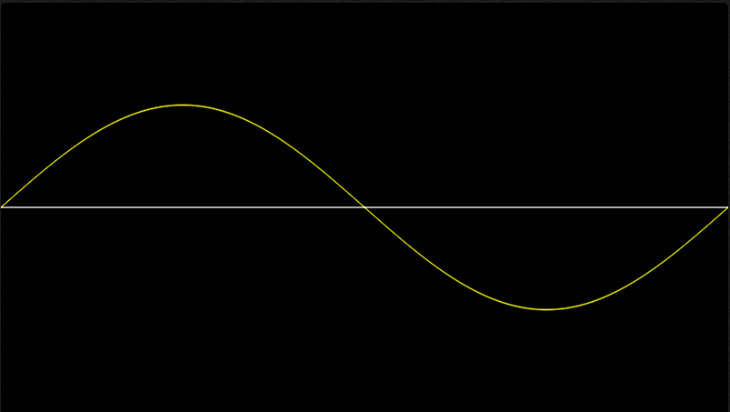

$$
\int_0^\pi sin(x) cos(x)dx = 0
$$

and

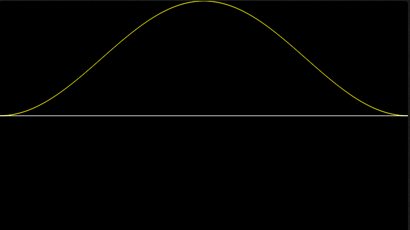

$$
\int_0^\pi sin(x)sin(x)dx\approx1.57
$$

Notice how in the case of $sin(x)cos(x)$ if we take the area under the curve, we see that half of our area is negative while the other half is positive. As opposed to $sin(x)sin(x)$ where the result is always positive or 0.

We will soon touch on why this is a valuable property for our spherical harmonics. But you can imagine that this implies that our functions do not "interfere" with each other.

An example of interference can be seen with the simple linear equations:

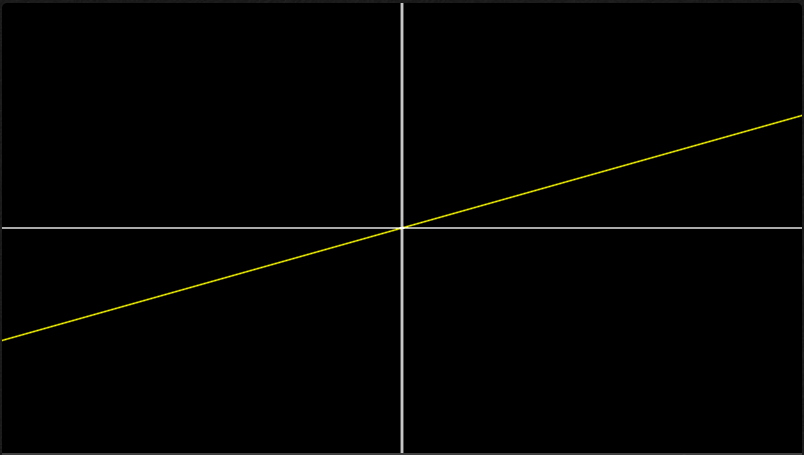

$$
b_0(x) = \frac{1}{2}x
$$

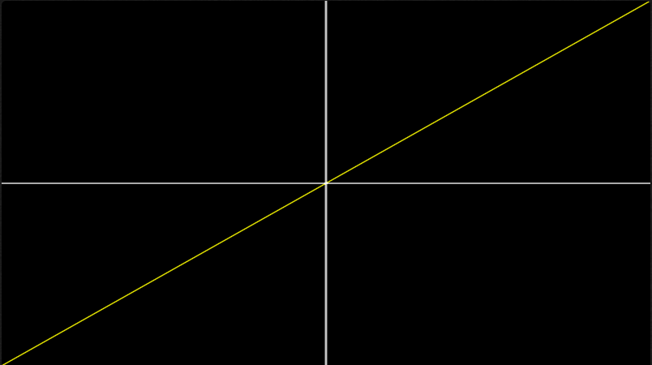

$$
b_1(x)=x
$$

If we were to try to use these as a basis function for the function

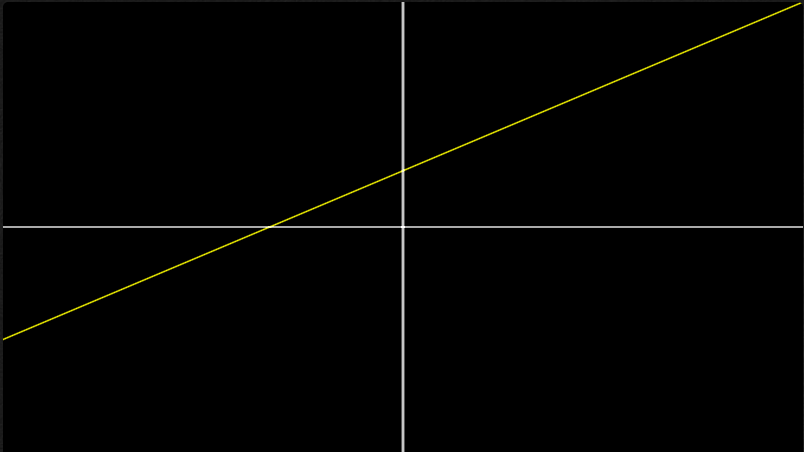

$$
h(x)=\frac{3}{4}x+\frac{1}{4}
$$

In the range $-1, 1$ we would get the coefficients:

$$
c_n=\int_{-1}^1 h(x)b_n(x)dx \\
c_0=\int_{-1}^{1}(\frac{3}{4}x+\frac{1}{4})(\frac{1}{2}x)dx=\frac{1}{4} \\
c_1=\int_{-1}^{1}(\frac{3}{4}x+3)(x)dx=\frac{1}{2}
$$

If we then try to reconstruct our function with $h(x)=c_0b_0(x)+c_1b_1(x)$ we get

$$
h(x)=\frac{1}{4}\frac{1}{2}x+\frac{1}{2}x
$$

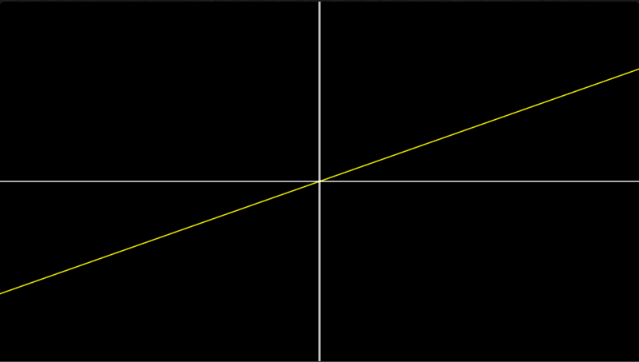

$$
h(x)=\frac{5}{8}x
$$

Oops! That's not our source function at all...

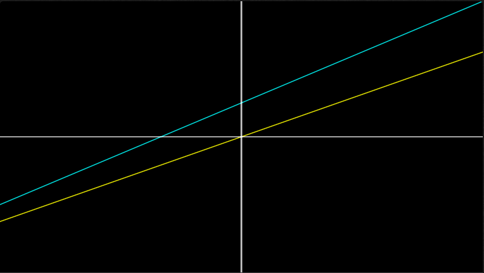

(Blue is our original $h(x)=\frac{3}{4}x+\frac{1}{4}$ while yellow is $h(x) = \frac{5}{8}x$)

If instead, we use the first 2 functions from the fundamental function of our spherical harmonics the Associated Legendre Polynomials we get:

$$
b_0(x)=1 \\
b_1(x)=x
$$

If we use these as our basis functions, we also need to normalize our coefficients [2] with $norm_n = \frac{2n+1}{2}$

$$
c_0=norm_0\int_{-1}^{1}(\frac{3}{4}x+\frac{1}{4})(1)dx=norm_06=\frac{1}{2}\frac{2}{4}=\frac{1}{4} \\
c_1=norm_1\int_{-1}^{1}(\frac{3}{4}x+\frac{1}{4})(x)dx=norm_1\frac{1}{2}=\frac{3}{2}\frac{1}{2}=\frac{3}{4}
$$

Combining them

$$
h(x)=c_0+c_1x \\
h(x)=\frac{1}{4}+\frac{3}{4}x
$$

Tada! We've moved from our function to constants for our basis and back. 

**Question:** Unfortunately, I'm not familiar with where this normalization constant comes from and why we have to use it here. If you happen to know, please reach out. I would be very happy to be enlightened and will happily amend this section with that information.

You'll notice that with our original functions above $b_0(x)=\frac{1}{2}x, b_1(x)=x$ we can't simply multiply our coefficients by a normalization constant to reconstruct our $\frac{1}{4}$ term (No constant value can remove the $x$ term!).

Now that we've defined orthogonal basis functions, here is a sample of the first few basis functions for our spherical harmonics

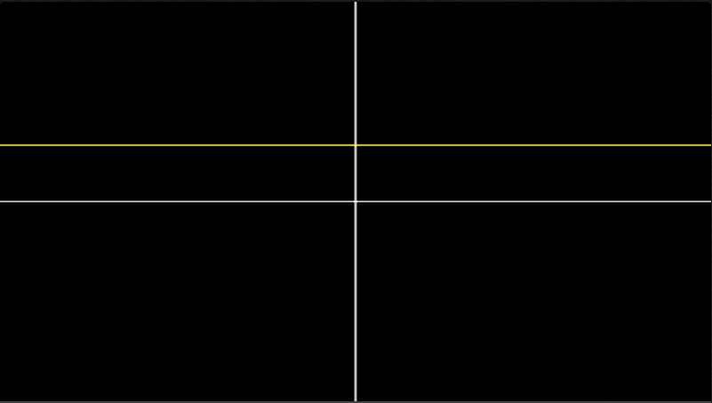

$$
HarmonicBasis_0(x)
$$

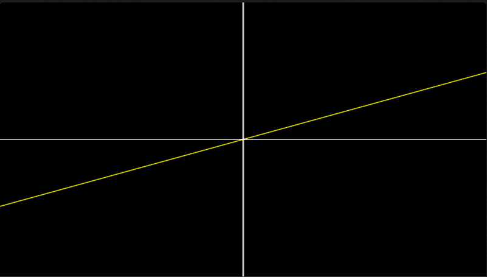

$$
HarmonicBasis_1(x)
$$

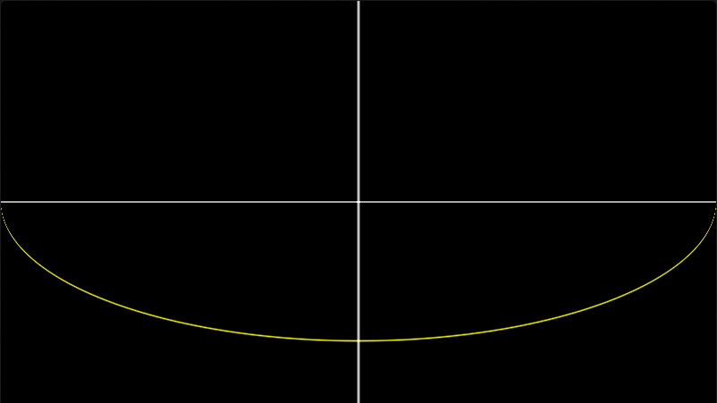

$$
HarmonicBasis_2(x)
$$

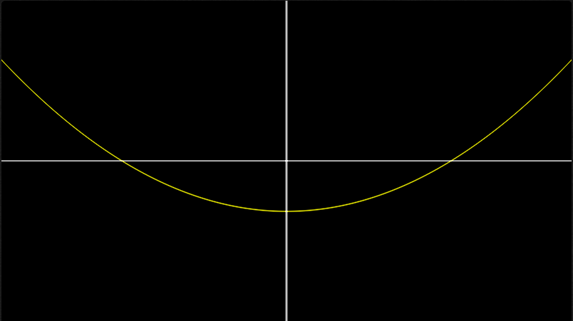

$$
HarmonicBasis_3(x)
$$

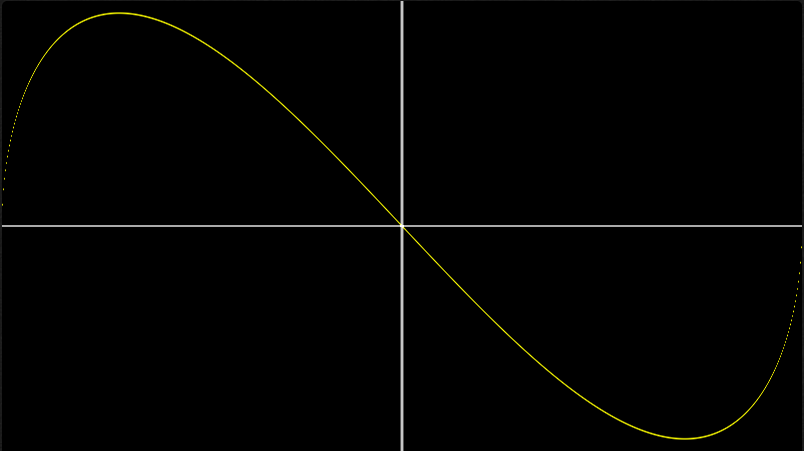

$$
HarmonicBasis_4(x)
$$

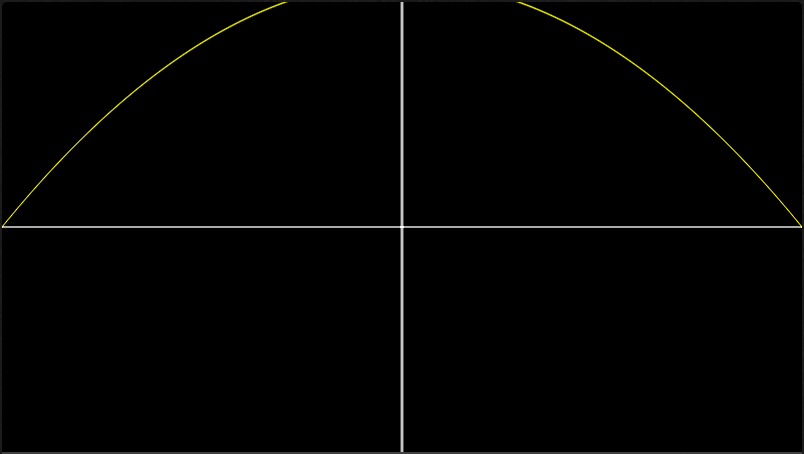

$$
HarmonicBasis_5(x)
$$

### Applying To The Sphere

The Associated Legendre Polynomials are only the first part of the picture for our spherical harmonics. The set of spherical harmonic functions are fully defined as:

$$
Y_l^m(\theta,\phi)=\left \{
\begin{array}{ll}
      \sqrt{2}K_l^{-m}P_l^{-m}(cos(\theta))sin(-m\phi) & m < 0 \\
      K_l^0P_l^0(cos(\theta)) & m = 0\\
      \sqrt{2}K_l^mP_l^m(cos(\theta))cos(m\phi) & m > 0 \\
\end{array}
\right.
$$

Where $P$ is our Associated Legendre Polynomial, $K$ is a normalization constant (we will be touching on what this means and why this is necessary soon), $l$ is our spherical harmonic band or order, $m$ is the index within that order where $-l \leq m \leq l$, $\theta$ is the angle from our pole and $\phi$ is our horizon angle.

**Question:** I'm not quite sure why we use the Associated Legendre Polynomials for spherical harmonics. Could we perhaps have used a Fourier Series instead? Is there any benefit to the use of this basis instead of another in graphics programming?

Robin Green [1] once again explains the meaning of $l$ and $m$ far better than I could. (Seriously, go read the paper)

> The two arguments $l$ and $m$ break the family of polynomials into bands of functions where the argument $l$ is the band index and takes any positive integer value starting from 0, and the argument $m$ takes any integer value in the range [0,l]. Inside a band the polynomials are orthogonal w.r.t. a constant term and between bands they are orthogonal with a different constant.

We can break these functions into 3 distinct parts. If we look at the case where $m > 0$

$$
\sqrt{2}K_l^mP_l^m(cos(\theta))cos(m\phi)
$$

We have

$$
\sqrt{2}K_l^m
$$

Which is our normalization constant (We will be touching on the meaning of this constant soon$^{tm}$)

$$
P_l^m(cos(\theta))
$$

Which is our Associated Legendre Polynomial applied along our vertical axis.

And

$$
cos(m\phi)
$$

Which is our function applied along the horizon of our sphere. (This would be $sin(-m\phi))$ if $m < 0$

If we visualize the vertical cross section of our function with $l=2, m=1$ we get:

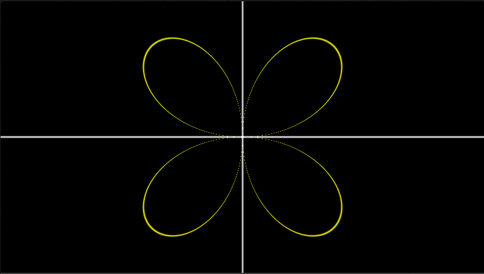

And the horizontal cross section we get:

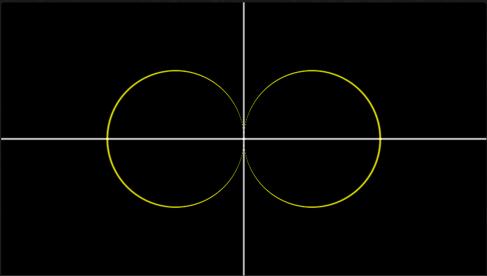

If we combine both of these in a 3D visualization, where the horizontal cross section is the view from the top down and the vertical cross section is the view from the front we get:

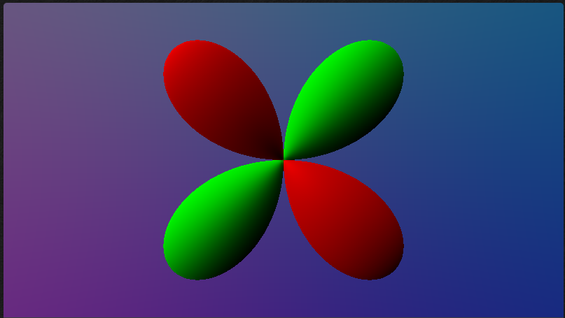

from the front and

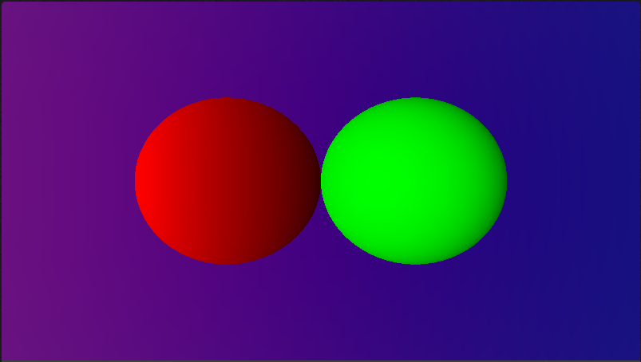

from the top. Identical to our original functions!

Additionally, here is one of my favourite basis functions $l=2, m=0$.

Vertical cross section:

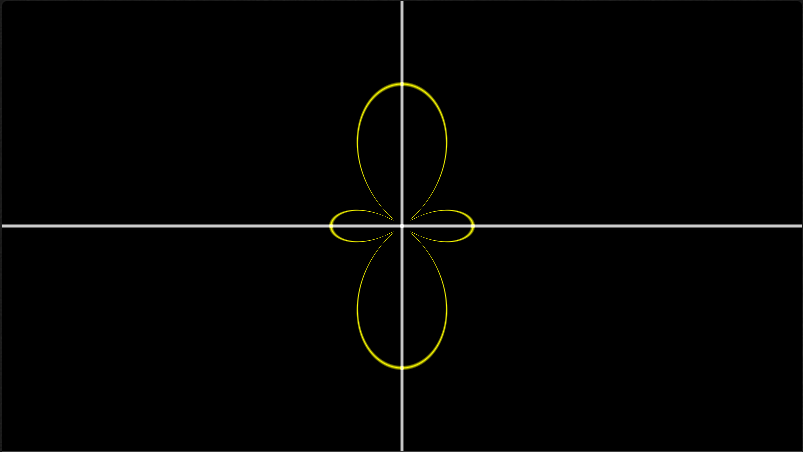

Horizontal section:

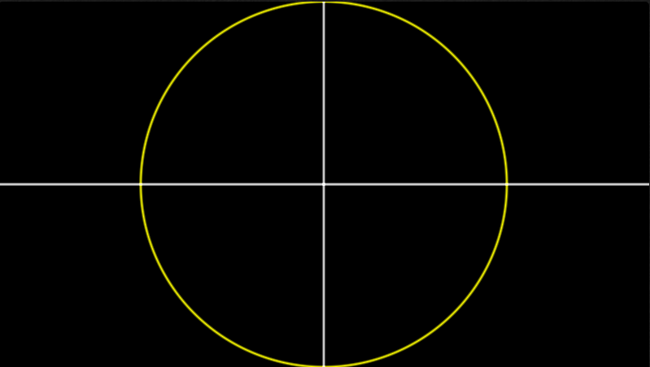

Visualizing the function in 3D from the front:

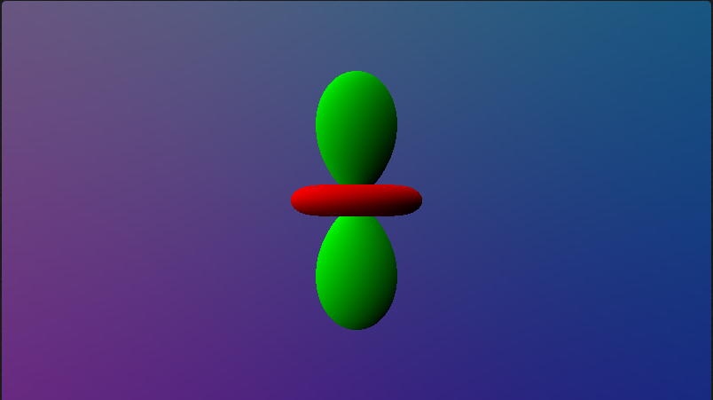

From the top:

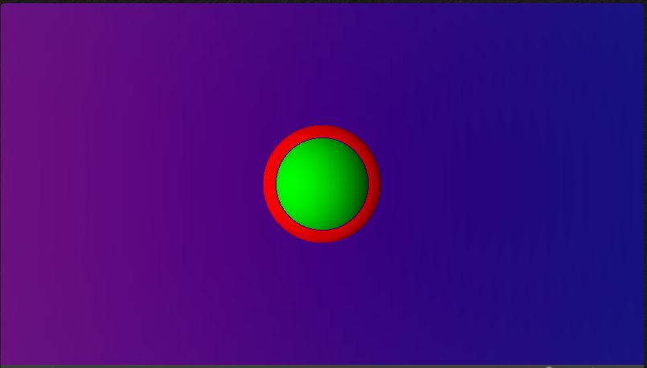

Hopefully that provides some insight into the primary pieces of the spherical harmonic functions!

### Practical Usage

It's important to note, that $g(x) = c_0b_0(x) + c_1b_1(x) + c_2b_x(x) + ... + c_nb_n(x)$ is only true when $n=\infin$. As a result, many functions can only be reconstructed perfectly with an infinite number of coefficients.

In practice, you'll only see a fixed number of coefficients (likely a pretty small number). In game rendering, you are likely to see 9 coefficients as a common number of terms used to represent irradiance (using spherical harmonics to represent irradiance is a very common use). 

Using only 9 terms means you get a very low frequency representation of your original function. As a result, you likely don't want to use a spherical harmonics representation for a high frequency function. (Something like a noise function would be very poorly approximated by spherical harmonics, see [3] for an excellent visualization of this property.). 

That's why you'll likely see it being used to represent values like irradiance which vary much more slowly across our sphere.

Here is an example of the irradiance of the cubemap in the background where the sphere's radius is scaled by the magnitude of the red channel of the irradiance. Notice how this is a very smooth shape with no sharp changes.

Here is the same irradiance, but represented using 4 spherical harmonic coefficients. Notice how, although not a perfect approximation, it is definitely similar to our original function.

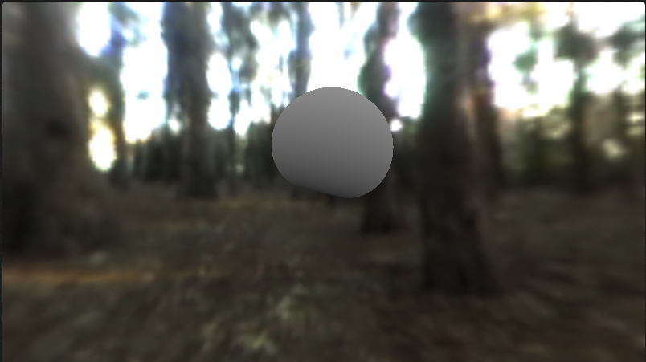

This is the premise underpinning the use of spherical harmonics to represent irradiance in games.

If you'd like to play around with this scene you can head over to the shadertoy here: https://www.shadertoy.com/view/7sKfzR

## Derivation Of Useful Properties (Math Ahoy!)

Given everything that we've touched on, we finally have all the pieces needed to talk about, and derive, some valuable properties of spherical harmonics.

#### Integration Of The Product (And That Pesky Normalization Constant)

One of the most valuable properties of spherical harmonics is that the integral of the product of two functions defined as spherical harmonic coefficients is equivalent to the dot product of those coefficients.

In essence, given two functions defined as a set of spherical harmonic coefficients:

$$
f(x)=c_0,c_1,c_2,...,c_n \\
g(x)=k_0,k_1,k_2,...,k_n \\
\int f(x)g(x)dx \approx c_0k_0+c_1k_1+c_2k_2+...+c_nk_n
$$

This property, if true, could be very valuable!

Imagine, we have a function $radiance(\vec{d})$ which describes the amount of light arriving in a particular direction. Additionally, imagine that we are able to define this function as a set of $n$ spherical harmonic coefficients $r_0,r_1,r_2,...r_n$.

If we were then to also define $\vec{d}.\vec{n}$ as a set of spherical harmonic coefficients $c_0,c_1,c_2,...c_n$, then we could transform the integral for irradiance from

$$
irradiance =\int_\Omega radiance(\vec{d})\lfloor\vec{d}.\vec{n}\rfloor d\omega
$$

to

$$
irradiance \approx r_0c_0+r_1c_1+r_2c_2+...+r_nc_n
$$

This would be quite useful! We could make very interesting use of this property to transform other functions into spherical harmonic coefficients to then apply to our radiance. See [3] for an interesting combination of spherical harmonics and ambient occlusion.

I will note that it is indeed possible to turn both our radiance function and our cosine term into spherical harmonic coefficients. Patapom [3] has an excellent breakdown of the topic. I highly recommend the read.

Unfortunately, I don't plan on explaining these particular pieces of the puzzle. I find all of the three linked resources above do a wonderful job of breaking down this topic.

What I want to touch on, is actually showing why this property:

$$
\int f(x)g(x)dx \approx c_0k_0+c_1k_1+c_2k_2+...+c_nk_n
$$

is true.

I think this is very clever and very interesting. I hope you find it even slightly as interesting as I do!

For illustration, we will start with two functions that are only represented using 2 coefficients.

$$
f(x)=c_0,c_1 \\
g(x)=k_0,k_1
$$

As we've seen before, with these coefficients, we can reconstruct an approximation of the functions by applying the coefficients to our basis functions:

$$
f(x) \approx c_0b_0(x)+c_1b_1(x) \\
g(x) \approx k_0b_0(x)+k_1b_1(x)
$$

With this approximation, we can substitute our two functions with our new formulation.

$$
\int f(x)g(x)dx \approx \int (c_0b_0(x)+c_1b_1(x))(k_0b_0(x)+k_1b_1(x))dx
$$

Expanding our new polynomial

$$
\int f(x)g(x)dx \approx \int (k_0c_0*b_0(x)^2+2k_0c_1*b_0(x)b_1(x)+c_1k_1*b_1(x)^2)dx
$$

Distributing our integral

$$
\int f(x)g(x)dx \approx k_0c_0\int b_0(x)^2dx+2k_0c_1\int b_0(x)b_1(x)dx+c_1k_1\int b_1(x)^2dx
$$

You may now be thinking that we haven't really simplified anything, but if you remember that our functions form an orthogonal basis. As a result

$$
\int f_i(x)f_j(x)dx=0, i\neq j \\
\int f_i(x)f_i(x)dx=c
$$

Which in this case means

$$
\int b_0(x)b_1(x)dx=0
$$

And

$$
\int b_0(x)^2dx=C \\
\int b_1(x)^2dx=K \\
$$

With these identities, our middle term $2k_0c_1\int b_0(x)b_1(x)dx$ cancels out!

And our outermost terms become

$$
k_0c_0\int b_0(x)^2dx = k_0c_0C \\
c_1k_1\int b_1(x)^2dx = k_1c_1K \\
\int f(x)g(x)dx \approx k_0c_0C+c_1k_1K
$$

But now we're stuck with some pesky constants that we don't know...

Fear not! Some very smart people have already figured this out and we finally get to revisit an important part of our spherical harmonic basis functions.

What is it?

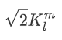

Our normalization constant!

From before!

This normalization constant being applied to our spherical harmonics actually changes this integral from

$$
\int f_i(x)f_i(x)dx=c
$$

To

$$
\int f_i^\prime(x)f_i^\prime(x)dx=1
$$

Where

$$
f_i^\prime(x) = \frac{1}{\sqrt c}f_i(x)
$$

As we are canceling out our constant term by dividing by our root such that

$$
\int f_i(x)f_i(x)dx=c \\
\frac{1}{c}\int f_i(x)f_i(x)dx=1 \\
\int \frac{1}{\sqrt c}f_i(x)\frac{1}{\sqrt c}f_i(x)dx=1 \\
$$

Looking at our spherical harmonic functions again

$$
Y_l^m(\theta,\phi)=\left \{
\begin{array}{ll}
      \sqrt{2}K_l^{-m}P_l^{-m}(cos(\theta))sin(-m\phi) & m < 0 \\
      K_l^0P_l^0(cos(\theta)) & m = 0\\
      \sqrt{2}K_l^mP_l^m(cos(\theta))cos(m\phi) & m > 0 \\
\end{array}
\right.
$$

If we assume that this theory about our normalization constants is true, then we should be able to see that the first part of our function (when $m=0$)

$$
P_l^m(cos(\theta))
$$

When integrated across our sphere, should give us a value of

$$
(K_l^m)^2
$$

From now on - we will expand $K_l^m$ as

$$
K_l^m=\sqrt{\frac{(2l+1)}{4\pi} \frac{(l-m)!}{(l+m)!}}
$$

Let's look at a simple case where $l=1, m=0$, as a result

$$
P_1^0(x)=x \\
p_1^0(cos(\theta))=cos(\theta)
$$

To calculate our orthogonal basis constant we need to integrate:

$$
\int f(x)f(x)dx=c \\
$$

Since we're integrating on a sphere using our spherical harmonic function we get

$$
\int_0^{2\pi}\int_0^{\pi}SphericalHarmonic_1^0(\theta,\phi)^2sin(\theta)d\theta d\phi=c \\
\int_0^{2\pi}\int_0^{\pi}P_1^0(cos(\theta))^2sin(\theta)d\theta d\phi=c \\
Since \space \int_0^{2\pi}d\phi=2\pi \\
2\pi\int_0^{\pi} P_1^0(cos(\theta))^2sin(\theta)d\theta=c \\
With \space P_1^0(cos(\theta))=cos(\theta) \\
2\pi\int_0^{\pi} cos(\theta)^2sin(\theta)d\theta=c \\
Where \space \int_0^{\pi} cos(\theta)^2sin(\theta)d\theta=-\frac{1}{3}cos(\pi)^3+\frac{1}{3}cos(0)^3 \\
-\frac{1}{3}cos(\pi)^3+\frac{1}{3}cos(0)^3=\frac{2}{3} \\
Thus \space 2\pi\frac{2}{3}=c \\
c = \frac{4\pi}{3}
$$

If $c=\frac{4\pi}{3}$ then given the logic above that our normalization constant should be

$$
Normalization=\frac{1}{\sqrt c}
$$

Then we get

$$
Normalization=\sqrt{\frac{3}{4\pi}}
$$

And if we solve

$$
K_l^m=\sqrt{\frac{(2l+1)}{4\pi} \frac{(l-m)!}{(l+m)!}}
$$

We get

$$
K_l^m=\sqrt{\frac{(2l+1)}{4\pi} \frac{(l-m)!}{(l+m)!}} \\
K_1^0=\sqrt{\frac{(2*1+1)}{4\pi} \frac{(1-0)!}{(1+0)!}} \\
K_1^0=\sqrt{\frac{3}{4\pi}} \\
$$

Matching our derived normalization constant!

<detail>

 Why do we need $\sqrt{2}$ in our normalization constant when $m \neq 0$ 

The reason we need $\sqrt{2}$ when $m \neq 0$ is relatively simple.

Above, we used the property that

$$
\int_0^{2\pi}d\phi=2\pi
$$
As a part of our normalization constant derivation.

However, when $m \neq 0$ we have the additional terms

$$
sin(-m\phi) & m < 0 \\
cos(m\phi) & m > 0
$$

You'll note that this changes our integration of $\phi$ from

$$
\int_0^{2\pi}d\phi=2\pi
$$

to

$$
\int_0^{2\pi}cos(m\phi)^2d\phi=y
$$

(Using $m > 0$ as an example here and squared due to how we're calculating our basis constant)

If we calculate the result of this integral, we get

$$
\int_0^{2\pi}sin(-m\phi)^2d\phi=\pi & m < 0\\
\int_0^{2\pi}cos(m\phi)^2d\phi=\pi & m > 0
$$

You'll notice that we're missing a factor of 2 from this integral as opposed to the version without a $cos$ or $sin$ term!

However, our original normalization constant was written with the expectation that we would have a factor of $2\pi$. As a result, we need to reintroduce this factor as a new constant. (As a square root here because of the formulation of our normalization constant as explained above)

</detail>

To recap these results, we can show that

$$
\int f(x)g(x)dx \approx c_0k_0+c_1k_1+c_2k_2+...+c_nk_n
$$

By using the fact that

$$
\int f_i(x)f_j(x)dx=0, i\neq j \\
\int f_i(x)f_i(x)dx=c
$$

But not only that the constant of a the product of a single function is $c$ but that in our case, the product is 1!

$$
\int f_i(x)f_i(x)dx=1
$$

This allows us to finally finish our derivation of:

$$
\int f(x)g(x)dx \approx k_0c_0C+c_1k_1K
$$

Since $C=1$ and $K=1$ due to our normalization constant. We finally get:

$$
\int f(x)g(x)dx \approx k_0c_0+c_1k_1
$$

And this property continues for any number of coefficients. (If unconvinced, I suggest running through the exercise for $n=3$ coefficients! Doing the exercise really helped solidify the idea for me.)

#### Interpolation Of The Coefficients

Another property of our coefficients, is that interpolating the result of our functions at any $x$ is equivalent to interpolating our coefficients and using the new resulting spherical harmonic coefficients.

$$
lerp(f(x), g(x), t)=lerp(c_0,k_0,t),lerp(c_1,k_1,t),...,lerp(c_n,k_n,t)
$$

First, we will use lerp in the form

$$
lerp(x, y, t)=(1-t)x+ty
$$

As we saw before, we can define our function in terms of our basis coefficients and our basis functions

$$
f(x) \approx c_0b_0(x)+c_1b_1(x)+...+c_nb_n(x) \\
g(x) \approx k_0b_0(x)+k_1b_1(x)+...+k_nb_n(x)
$$

If we plug these into our lerp equation (using the 2 coefficient form for simplicity)

$$
lerp(f(x), g(x), t)=(1-t)(c_0b_0(x)+c_1b_1(x))+t(k_0b_0(x)+k_1b_1(x)) \\ 
lerp(f(x), g(x), t)=(1-t)c_0b_0(x)+(1-t)c_1b_1(x)+tk_0b_0(x)+tk_1b_1(x) \\
Rearranging \\
lerp(f(x), g(x), t)=(1-t)c_0b_0(x)+tk_0b_0(x)+(1-t)c_1b_1(x)+tk_1b_1(x) \\
lerp(f(x), g(x), t)=((1-t)c_0+tk_0)b_0(x)+((1-t)c_1+tk_1)b_1(x)
$$

If we look at the final form of our equation

$$
((1-t)c_0+tk_0)b_0(x)+((1-t)c_1+tk_1)b_1(x)
$$

We can package the terms before our basis functions as new basis coefficients

$$
m_0=(1-t)c_0+tk_0 \\
m_1=(1-t)c_1+tk_1
$$

Which as we've seen above, is the form of our $lerp$ function!

$$
m_0=lerp(c_0,k_0,t) \\
m_1=lerp(c_1, k_1, t)
$$

#### Addition Of Coefficients And Multiplication By A Scalar

Finally, for a few additional simple derivations before we wrap things up.

##### Addition Of Coefficients

Proof that addition of our functions is equivalent to addition of our coefficients.

$$
f(x)+g(x)=c_0+k_0, c_1+k_1,...,c_n+k_n
$$

Replacing our functions with our coefficients and basis functions we get:

$$
f(x)+g(x) \approx c_0b_0(x)+c_1b_1(x)+k_0b_0(x)+k_1b_1(x) \\
f(x)+g(x) \approx c_0b_0(x)+k_0b_0(x)+c_1b_1(x)+k_1b_1(x) \\
f(x)+g(x) \approx (c_0+k_0)b_0(x)+(c_1+k_1)b_1(x) \\
m_0=c_0+k_0 \\
m_1=c_1+k_1
$$

##### Multiplication By A Scalar

Proof that multiplying our function by a scalar is equivalent to multiplying our coefficients.

$$
Af(x) \approx Ac_0, Ac_1, ..., Ac_n
$$

Replacing our functions with our coefficients and basis functions we get:

$$
Af(x) \approx A(c_0b_0(x)+c_1b_1(x)) \\
Af(x) \approx Ac_0b_0(x)+Ac_1b_1(x) \\
m_0=Ac_0 \\
m_1=Ac_1
$$

And we're done! The math is complete! Thanks for reading all the way to the end of this part!

## Final Thoughts And Questions

Hopefully, this has provided some interesting insights into the magical world of spherical harmonics!

I know that I find myself far more comfortable in the meaning of these functions and their implementations after writing this. 

If you haven't read the 3 links shared above, I highly recommend them. I found them incredibly insightful and they touch on a variety of practical and theoretical aspects of spherical harmonics that I did not touch on in this post. (Especially in terms of their practical usage in graphics programming) 

If you're interested in visualizing and playing with the various pieces described here. I've created a few shadertoys that you can explore and modify to your hearts content (These were used for the various graphs and images shown above).

* https://www.shadertoy.com/view/ssVfRR - Visualize the Associated Legendre Polynomials
* https://www.shadertoy.com/view/sdGBRh - Visualize how the spherical harmonics are applied to a circle for both the vertical and horizontal cross sections.
* https://www.shadertoy.com/view/7sKBzR - Visualize spherical harmonics in 3D where the value of the harmonic is used to scale a unit sphere.
* https://www.shadertoy.com/view/7sKfzR - Visualize a representation of irradiance using spherical harmonics along with a ground truth irradiance calculation for comparison.

As presented throughout the post, I am left with some lingering questions. If you happen to have insights about them, please reach out!

* I'm not familiar with where the normalization constant for the Associated Legendre Polynomials comes from and why we have to use it here. If you happen to know, please reach out.
* I'm not quite sure why we use the Associated Legendre Polynomials for spherical harmonics. Could we perhaps have used a Fourier Series instead? Is there any benefit to the use of this basis instead of another in graphics programming?

This is a bit of an experimental approach to a blog post. Hopefully this was easy to read and navigate.

Bye!

## References

[1] https://3dvar.com/Green2003Spherical.pdf

[2] https://en.wikipedia.org/wiki/Legendre_polynomials#Orthogonality_and_completeness

[3] https://patapom.com/blog/SHPortal/

[4] https://www.ppsloan.org/publications/StupidSH36.pdf
