# Why Do Reflections Stretch At The Horizon?

Often, when I walk along the Ottawa river, I like to look at the reflections.

// TODO: Picture of water in Ottawa

Notice that the reflections at the horizon are stretching vertically.

As part of a research period at Snowed In Studios, I investigated potential approximations for these stretchy reflections and in the process, I worked on developing an intuition for **why** they exist.

I thought I would share that with you!

## A Brief Detour Into Microfacet Models

For this post, I'm assuming that the reader is not familiar with microfacet models. If you are, feel free to skip ahead.

Let's take a brief detour to summarize microfacets and perfect mirrors as these details are necessary to understand why we get those stretchy reflections.

I will skim over a lot. If you want a deeper breakdown of BRDFs and microfacet models I recommend these various blog posts, papers and books that provide a much deeper and more informative view:

- [Filament Documentation](https://google.github.io/filament/Filament.md.html#materialsystem/standardmodel)
- [Physically Based Rendering:
From Theory To Implementation - Microfacet Models](https://www.pbr-book.org/3ed-2018/Reflection_Models/Microfacet_Models)
- [Crash Course in BRDF Implementation](https://boksajak.github.io/files/CrashCourseBRDF.pdf)
- [Construction of a Microfacet Specular BSDF: A Geometric Approach](https://zero-radiance.github.io/post/microfacet-specular/)
- [Understanding the Masking-Shadowing Function in Microfacet-Based BRDFs](https://jcgt.org/published/0003/02/03/)

Common lighting models in games make use of whats called a microfacet model. To highlight the idea behind these models, let's look at a physical example.

This is a piece of zinc-plated steel.

If I were to ask you: "Is this a flat surface?" It seems likely that you would say yes! But if we take a microscopic view of the cross section, you'll see that it's actually quite a bit bumpy!

This cross section highlights the core idea of microfacet models. These models assume that a large, flat surface is made up of tiny little perfectly flat segments to make up a "microsurface".

Instead of having a flat surface.

We have a bumpy one made up of tiny little flat surfaces.

Specular microfacet models make another assumption.

What if all of these tiny little surfaces are actually perfect mirrors?

Where a perfect mirror is a surface that will reflect incoming light in a single direction. None of that "scattering" stuff. We want **perfect** reflections here! (You'll often see the words "Dirac delta" thrown around when talking about perfect mirrors)

This assumption drastically simplifies the mathematics of our model.

So we have a large number of little surfaces that we called microfacets and we also assume that they're perfect mirrors.

What's next?

### Reflections

We need to find out how much light reaches the viewer!

To find out, we need to know how much light each microfacet reflects towards our view direction. Since we assumed that our surface was made up of tiny little perfect mirrors, only a single exact orientation of mirror will reflect light to our viewer. Every other mirror will not contribute to what our viewer sees.

We need to know how many of these microfacets are facing in that direction.

Once we have that proportion, determining the amount of light received by our viewer for a particular light direction is simply a matter of multiplying the total amount of light by the proportion of microfacets that align with the "right" orientation.

$$
Light_{Out} = Proportion(Orientation) * Light_{In}
$$

(I'm choosing to ignore shadowing and masking for simplicity - for a more thorough and accurate overview of microfacet models, take a look at some of the links I shared above. They're really good!)

What **is** this exact orientation of mirror?

It's simply the microfacet with a normal that points halfway between our light vector and view vector.

The normal of that microfacet is usually called the half vector.

Calculating our half vector is as simple as adding up our light and view vectors and then normalizing them.

$$
Half = normalize(LightDir + ViewDir)
$$

Now we know the normal of the surfaces that will reflect light to the viewer given a particular light and view direction. We can then plug that into our original equation to determine the amount of light seen by our viewer!

$$
\begin{aligned}
Half = normalize(LightDir + ViewDir) \newline
Light_{Out} = Proportion(Half) * Light_{In}
\end{aligned}
$$

### Distributions

Now that we have a series of perfect mirror microfacets and we know how to determine the amount of light the viewer receives, we simply need to figure out how to calculate the proportion of microfacets that point in the direction of our half vector.

What we need is a distribution!

Perhaps we could use a Gaussian distribution? We could assume that the mean of our distribution matches the normal of our geometry.

Below is an example of our macro geometry. The geometry before we apply our distribution.

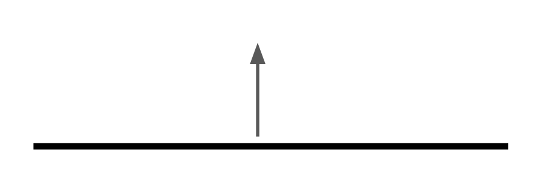

When we assume that our macro geometry is actually made up of microfacets following a Gaussian distribution, we get something similar to the original microsurface we described above.

Since our geometry is described by a Gaussian distribution, we can modify the standard deviation of our distribution to vary between a smooth and rough microsurface.

A wider distribution would describe a rough surface.

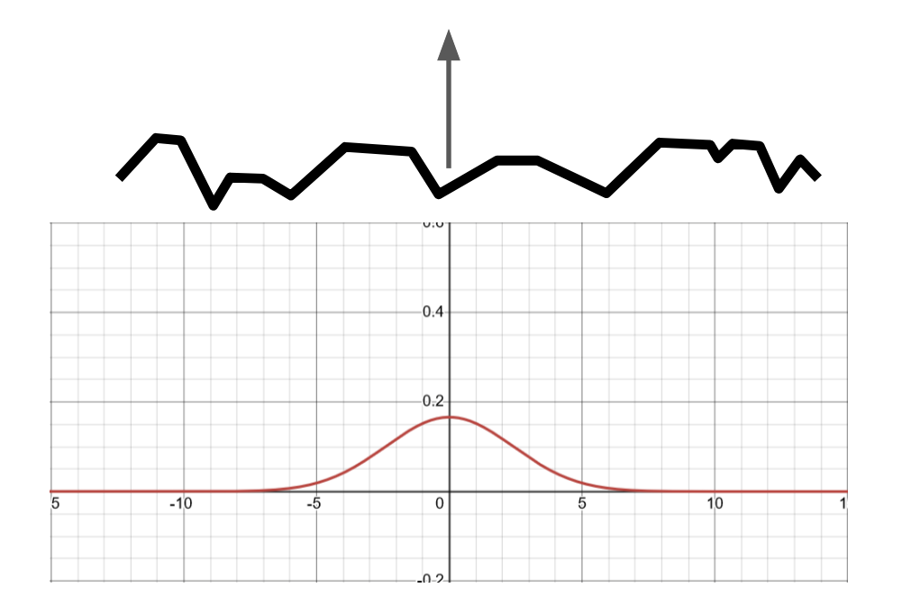

While a narrow distribution would describe a smoother surface.

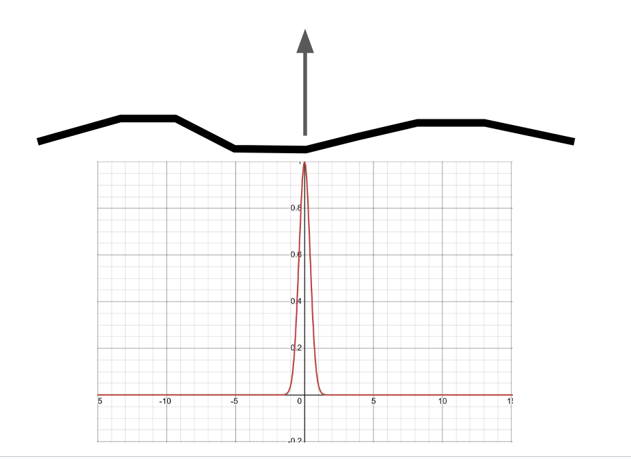

#### Mapping To Slope Space

We have a problem though...

How do we map a Gaussian distribution to our microfacet normals?

Our microfacet normals are three dimensional unit vectors. Isotropic Gaussian distributions are easily described in two dimensions.

If we could convert our normal into a two dimensional vector, we could input that value into a two dimensional Gaussian distribution and find out the proportion of normals that we've been looking for!

The transformation we're looking for is a transformation into slope space.

For the purposes of this post, we won't be describing slope space. You can read more about it here: [Slope Space in BRDF Theory](https://www.reedbeta.com/blog/slope-space-in-brdf-theory/). For even more reading, slope space can be viewed as a specialization of a stereographic projection which is you can read more about on [Wikipedia](https://en.wikipedia.org/wiki/Stereographic_projection).

What matters to us is that slope space allows us to transform our three dimensional unit vector into a two dimensional vector.

We can visualize our two dimensional Gaussian as a contour map where our center has the highest value and the values decrease as we move away from the center.

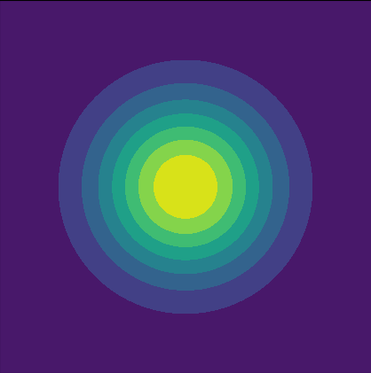

Note that the center of our 2 dimensional Gaussian represents our macro surface normal.

This macro surface normal:

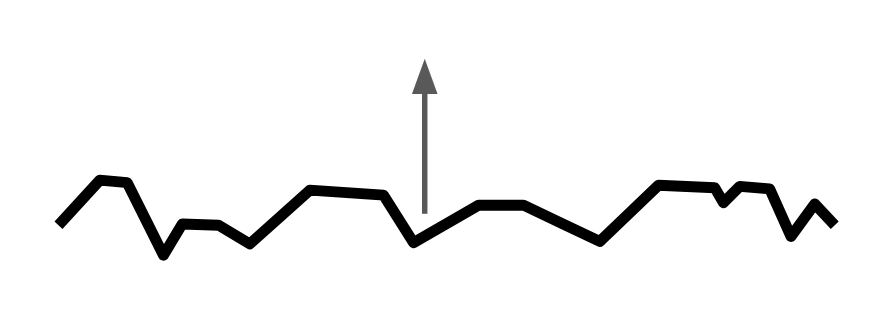

Is equivalent to this point on our Gaussian distribution:

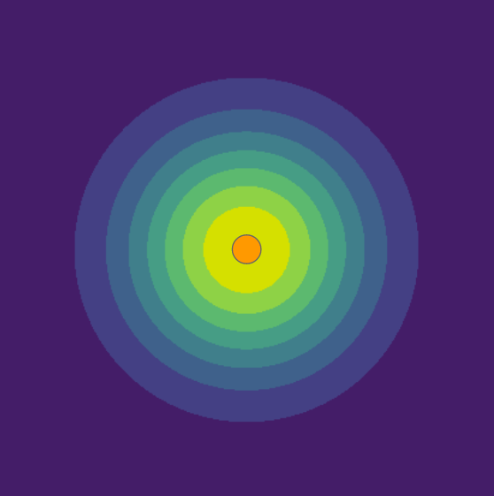

As a result, if we wanted to know the proportion of microfacets that have this normal:

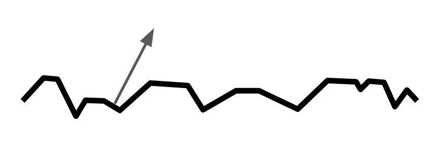

We might sample this point on our Gaussian:

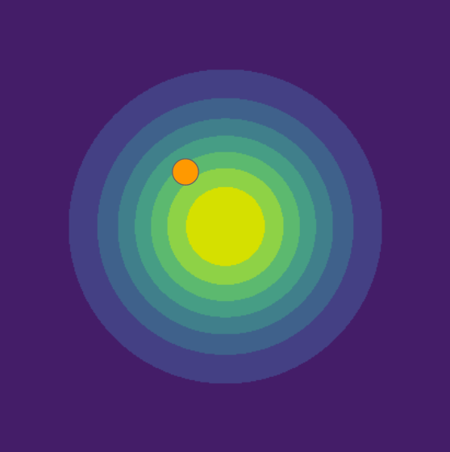

### Putting It All Together

We have almost all the pieces we need to describe *why* reflections stretch along the horizon given a microfacet model.

Let's review.

We have a macro surface with a normal.

We add micro detail.

We add a view direction.

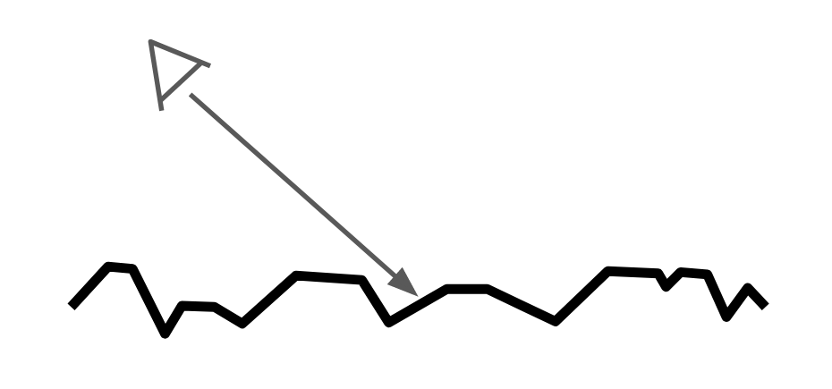

We add a light direction.

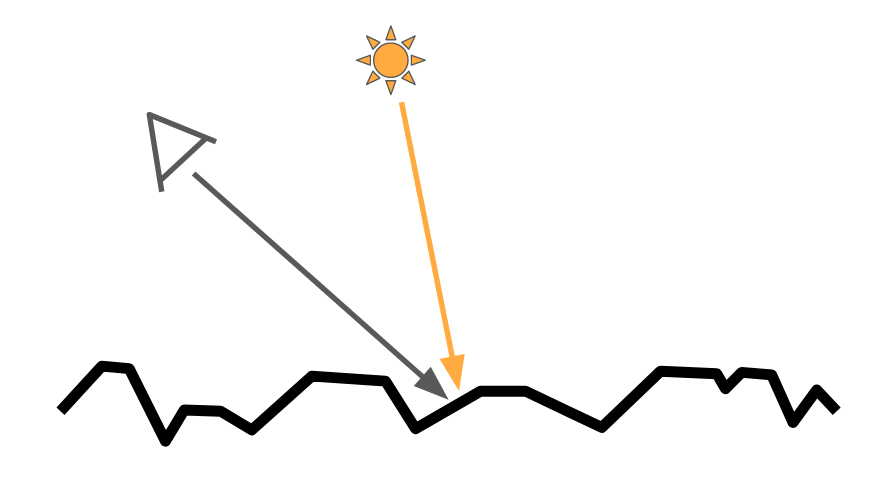

From there, we can calculate the halfway vector between the view and light direction.

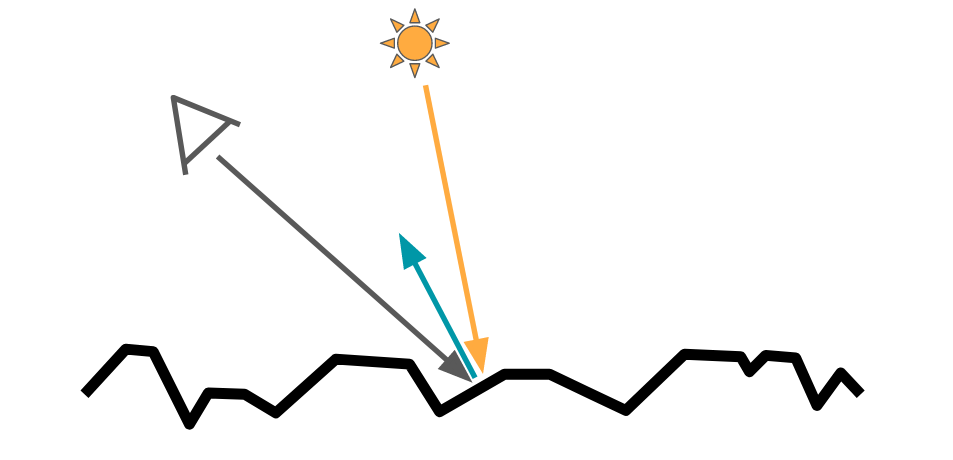

We take the half vector and convert it to slope space and sample our Gaussian at that point.

Finally, we multiply the result of our distribution by our light intensity and we're done!

$$
\begin{gather*}
Half = normalize(LightDir + ViewDir) \newline
Light_{Out} = Gaussian(ToSlopeSpace(Half)) * Light_{In}
\end{gather*}
$$

(Keeping in mind that I'm omitting many details but none of them important for this particular exploration)

## Reflections And Why They're Stretchy

At this stage, we should have every piece we need to understand why reflections become stretchy at the horizon.

The secret lies in our use of the half vector and centering our distribution around our macro surface normal. Let's break that down.

First, we'll explore a case where the reflections do not stretch. When our view vector aligns with our macro surface normal, our reflections are fully isotropic. I.e. they do not stretch along a particular axis.

In order to determine what our reflection should look like in the first place, we need to accumulate the light arriving at our surface from all directions.

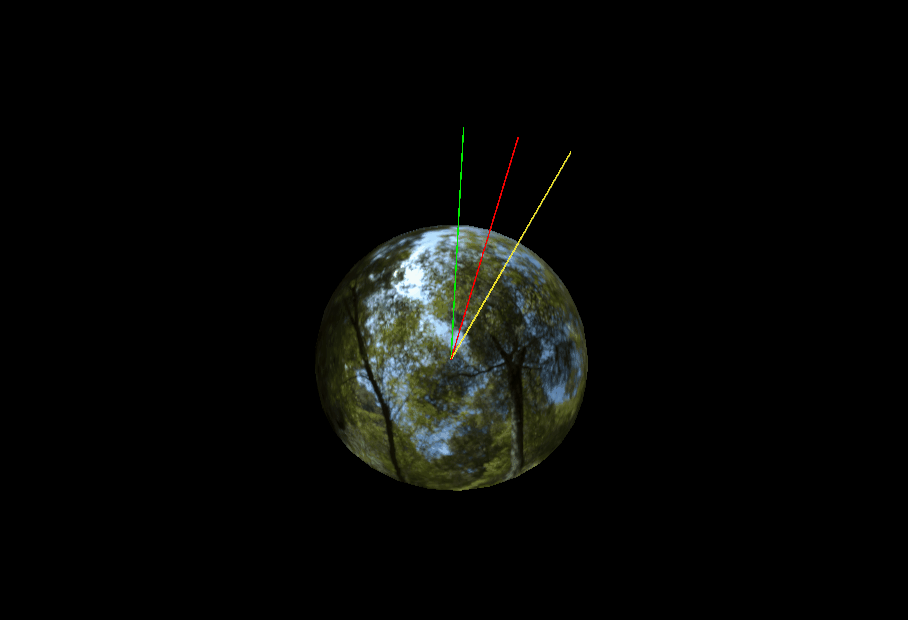

The green line is our view vector, the red is our half vector and the yellow is our light vector. As you can see, the half vector remains at a constant distance from our sphere's apex.

If we visualize this in slope space with our Gaussian, it would look something like this.

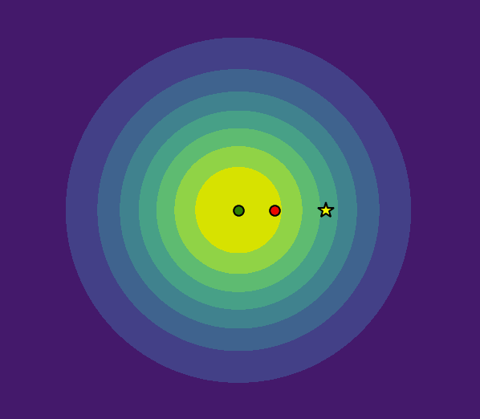

And finally, if we visualize the result of our Gaussian for each light direction to our final reflection result we get a nice circular shape.

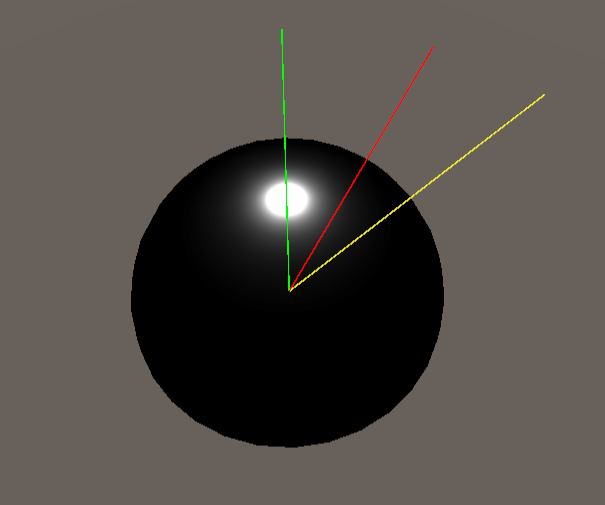

All of this aligns with a nice, uniform, non-stretchy reflection.

But what if we view our surface at an angle closer to the horizon?

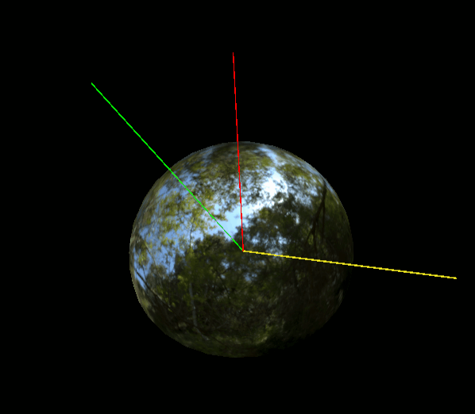

Hm... that looks different. Lets look at it from the top.

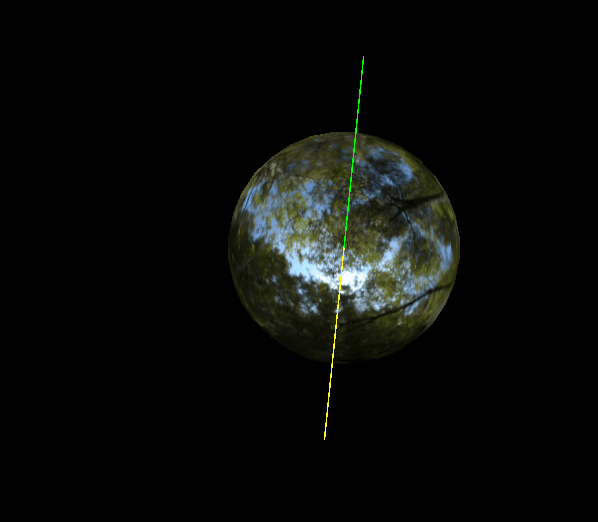

Notice how as we move our view vector along the horizon our half vector moves away from the apex? Let's investigate this a bit further in slope space.

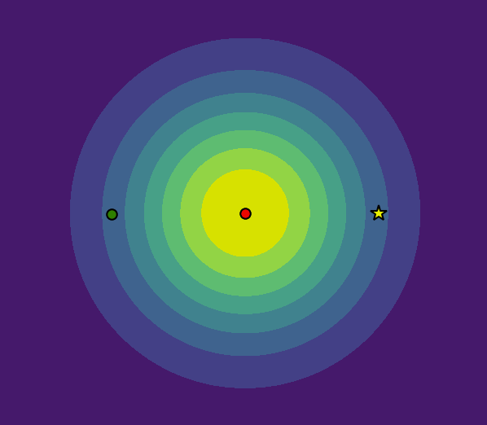

This matches the behaviour we observed in 3D. Our half vector is moving away from the center of our distribution with the most influence. What happens to our half vector if we vary the altitude of our light vector?

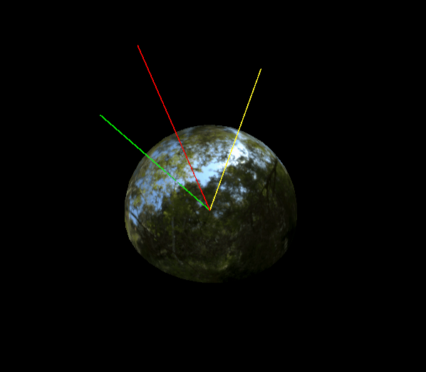

It seems as though our half vector is moving away from our apex at different rates based on the altitude of our view vector!

Let's validate that in slope space.

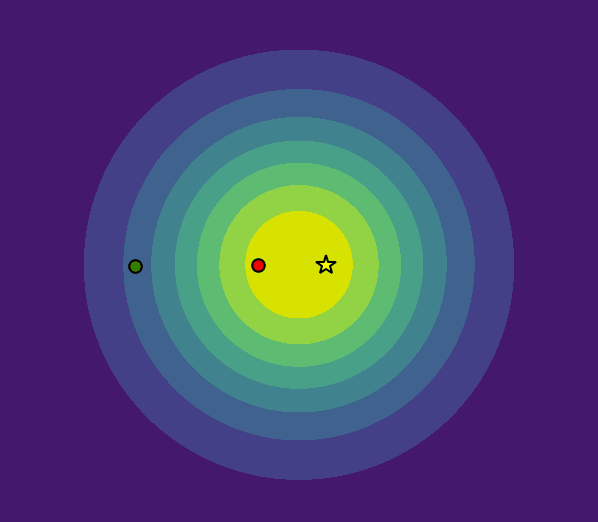

Notice how our half vector moves away from the center of our distribution at a faster rate as our light vector moves closer to the horizon!

As a result, we would expect to see the influence of a particular light vector to get narrower the closer it gets to the horizon.

What does it look like when we visualize the influence for each light vector on a hemisphere? It looks like this.

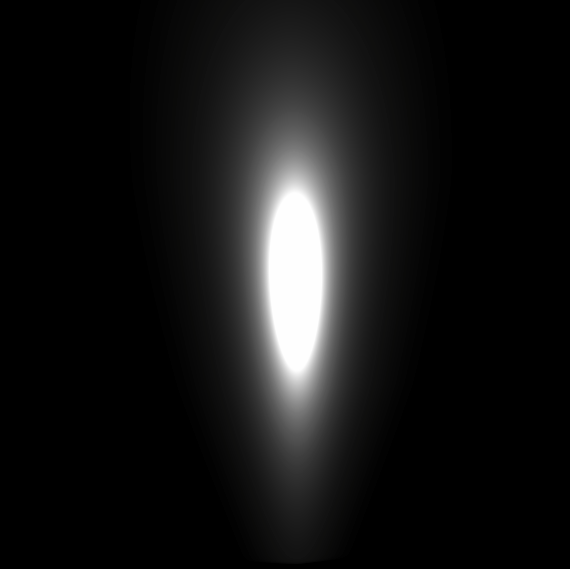

A stretched area of influence which **finally** results in a stretchy reflection!

## Conclusion

And that's it!

Because our half vector moves away from our macro surface normal at an increased rate as the light vector approaches the horizon, the area that contributes to the reflection is "squished" along the horizontal axis.

There are three elements that contribute to stretchy reflections when viewed at the horizon.

1. The use of the half vector to determine the proportion of microfacets that are reflecting light to the viewer.
2. Centering our microfacet distribution around our macro surface normal.
3. Distributing the majority of our microfacets around the macro surface normal.

Hopefully this was insightful to you! If you have any questions or comments, you can reach out to me on Mastodon at [@AlexSneezeKing@mastodon.gamedev.place](https://mastodon.gamedev.place/@AlexSneezeKing).

# Bonus Content - Trying (And Failing) To Approximate Anisotropic Reflections

You're still here?

Great!

Let's talk about my failed attempts at approximating anisotropic reflections for image based lighting.

Fair warning, I am assuming the reader of this section is familiar with the ideas behind the Split-Sum Approximation for image based lighting. For a refresher, the links below describe the technique.

- [Real Shading in Unreal Engine 4](https://cdn2.unrealengine.com/Resources/files/2013SiggraphPresentationsNotes-26915738.pdf)
- [Alternative Take on the Split Sum Approximation for Cubemap Pre-filtering](https://zero-radiance.github.io/post/split-sum/)

A limitation of this technique is the fact that we use an isotropic approximation of our convolved lighting environment.

I wanted to explore potential approximations that could allow for anisotropic reflections at grazing angles.

## Analyzing The Data

Let's visualize the data. I built a shadertoy sample that explores how our colors change along the longitude of  

## Spherical Harmonics

## Fourier Terms

## Solving For A Reflection Vector Stretch And Bias

