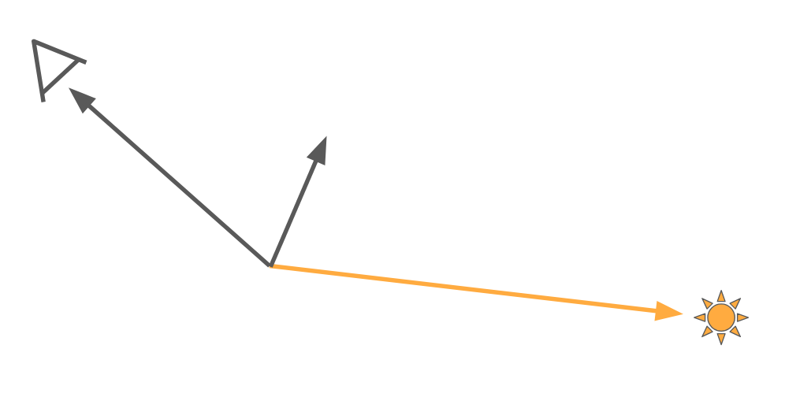

# Why Do Reflections Stretch At The Horizon?

Often, when I walk along the Ottawa river, I like to look at the reflections.

// TODO: Picture of water in Ottawa

Notice that the reflections at the horizon are stretching vertically.

As part of a research period at Snowed In Studios, I investigated potential approximations for these stretchy reflections and in the process, I worked on developing an intuition for **why** they exist.

I thought I would share that with you!

## A Brief Detour Into Microfacet Models

For this post, I'm assuming that the reader is not familiar with microfacet models. If you are, feel free to skip ahead.

Alright, let's take a brief detour to summarize microfacets and perfect mirrors as these details are necessary to understand why we get those stretchy reflections.

I will skim over a lot. If you want a deeper breakdown of BRDFs and microfacet models I recommend these various blog posts, papers and books that provide a much deeper and more informative view:

- [Filament Documentation](https://google.github.io/filament/Filament.md.html#materialsystem/standardmodel)
- [Physically Based Rendering:
From Theory To Implementation - Microfacet Models](https://www.pbr-book.org/3ed-2018/Reflection_Models/Microfacet_Models)
- [Crash Course in BRDF Implementation](https://boksajak.github.io/files/CrashCourseBRDF.pdf)
- [Construction of a Microfacet Specular BSDF: A Geometric Approach](https://zero-radiance.github.io/post/microfacet-specular/)
- [Understanding the Masking-Shadowing Function in Microfacet-Based BRDFs](https://jcgt.org/published/0003/02/03/)

Let's get started.

Common lighting models in games make use of whats called a microfacet model. To highlight the idea behind these models, let's look at a physical example.

This is a piece of zinc-plated steel.

If I were to ask you: "Is this a flat surface?"

It seems likely that you would say yes!

But if we take a microscopic view of the cross section, you'll see that it's actually quite a bit bumpy!

(This image is not the cross section of the exact piece of metal above... I do not own zinc-plated steel... or a microscope)

This cross section describes the core of microfacet models. These models assume that a large, flat surface is actually made up of tiny little perfectly flat segments to make up a "microsurface".

Instead of having a flat surface like this.

We have a bumpy one made up of tiny little flat surfaces.

Then, we make another assumption.

What if all of these tiny little surfaces are actually perfect mirrors?

Where a perfect mirror is a surface that will reflect incoming light in a single direction. None of that "scattering" stuff. We want **perfect** reflections here! (You'll often see the words "Dirac delta" thrown around when talking about perfect mirrors)

This assumption drastically simplifies the mathematics of our model.

So we have a large number of little surfaces that we called microfacets and we also assume that they're perfect mirrors.

What's next?

### Reflections

We need to find out how much light reaches the viewer!

To find out, we need to know how much light each microfacet reflects towards the viewer. Since we assumed that our surface was made up of tiny little perfect mirrors, only a single exact orientation of mirror will reflect light to our viewer. Every other mirror will not contribute to what our viewer sees.

We need to know how many of these microfacets are facing in that direction. I.e. what is the proportion of microfacets with that direction.

Once we have that proportion, determining the amount of light received by our viewer for a particular light direction is simply a matter of multiplying the total amount of light by the proportion of microfacets that align with the "right" orientation.

$$
Light_{Out} = Proportion(Orientation) * Light_{In}
$$

(I'm choosing to ignore shadowing and masking for simplicity - for a more thorough and accurate overview of these models, take a look at some of the links I shared above. They're really good!)

What **is** this exact orientation of mirror?

It's simply the microfacet with a normal that points halfway between our light vector and view vector. The normal of that microfacet is usually called the half vector.

Calculating our half vector is as simple as adding up our light and view vectors and then normalizing them.

$$
Half = normalize(LightDir + ViewDir)
$$

Now we know the normal of the surfaces that will reflect light to the viewer given a particular light and view direction. We can then plug that into our original equation to determine the amount of light seen by our viewer!

$$
\begin{aligned}
Half = normalize(LightDir + ViewDir) \newline
Light_{Out} = Proportion(Half) * Light_{In}
\end{aligned}
$$

// Outline

What do I need to touch on for this to make sense?

- Some familiarity with microfacet BRDFs
    - Specular BRDFs are modeled as a small bumpy surface (typically a heightfield)
        - https://google.github.io/filament/images/diagram_microfacet.png
        - Each of those lines in the image is typically called a "microfacet"
        - You can think of it as a series of small perfect mirrors
    - How each of these mirrors is distributed can described by some function
        - That distribution (The normal distribution function/NDF) describes how _many_ of these mirrors will point in a particular direction
        - Common BRDFs will model a distribution where most of the microfacets will align with the macro surface normal (i.e. your geometry's normal)
            - https://www.scribbr.com/wp-content/uploads/2023/02/standard-normal-distribution-example.webp

- Lets step back and think about perfect mirrors and point lights
    - A perfect mirror will simply reflect your view vector along its normal
        - https://docs.unity3d.com/StaticFiles/ScriptRefImages/Vec3ReflectDiagram.png
    - For a point light, a single direction will contribute to a single point on the surface
        - https://www.tutorialspoint.com/javafx/images/point_light_source.jpg
    - Given our view vector and light vector, we can figure out what angle a perfect mirror should be for us to see the light source
        - Any other direction, no light source

- As we know, our surface is made up of some distribution of perfect mirrors
- We also have a light direction and a view direction that tell us what normal we need to see our point light

- From there, we can ask:
    - How many, of the MANY little mirrors, match that normal? I.e. how many of these mirrors actually reflect any light towards the viewer?
        - You can think of this question more formally as "What is the _density_ of mirrors that point in this particular direction?"
    - We can calculate that normal (usually called the _half_ vector) and plug that into our distribution to get that proportion!

- Okay, we have the background we need to figure out why reflections are stretchy at the horizon!
- First, lets look at a distribution that might be used for a common BRDF, the gaussian distribution.
    - https://learn.astropy.org/tutorials/nboutput/synthetic-images.ipynb_23_1.png
    - In this 2D space, each point represents a particular normal of our microsurface and the intensity of the function represents the proportion of mirrors that face that particular direction

- Lets imagine a particular example where a view vector and a light vector gives us a half vector
    - We would then plug that half vector into our function and get out some value to use for our lighting calculation.

- Up to this point, we've been talking about using a point light, but what about something like a cubemap?
    - Well, then we just want to accumulate the light from all possible directions in the hemisphere and sum their contributions!

- This is all well and good
    - But there's still no stretchiness!
    - The function we saw is perfectly symmetrical.
        - We would expect to see something a bit like this instead https://n-o-r.xyz/images/gp/2d_gaussian.png
            - Where the contributions of each normal is clearly asymetric

- But that's not where the stretchiness comes from.

- The stretchiness is actually from how we define our half vector...

- Lets visualize that
    - Notice how, when our view vector is parallel to our macro surface normal, everything is right in the world.
    - But, see what happens when my view vector slowly wanders away from the macro normal
        - See how our half vector moves away from our center of influence as we move along the major axis
        - And see how it move dramatically more quickly as we move along our minor axis!
    - What happens if we plot that on a sphere?
        - You get an asymmetrical lobe!

- And that's it!
    - That's why reflections are stretchy under our BRDF models!
        - Its a combination of the formulation of specular BRDFs as perfect mirrors and the rate at which half vectors move away from the macro surface normal at different viewing angles.

# Bonus Content - Trying (And Failing) To Approximate It