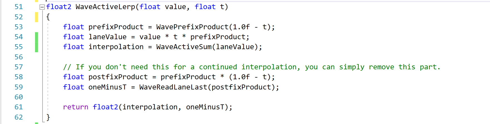

# Interpolation Using Wave Intrinsics

I've been meaning to write about this little utility function I discovered a few months ago but I keep getting distracted.

In order to actually get it out the door, we're going to write a tiny post about it so that I can finally move on.

The problem statement is simple.

"Can we implement an interpolation function that interpolates across a wave's lanes in your shader?"

The answer is equally as simple.

"Yes!"

Imagine that you have a simple loop.

```
float2 Values[];
uint ValueCount;

float interpolation = 0.0f;
for(uint i = 0; i < ValueCount; i++)
{
	interpolation = lerp(interpolation, Values[i].x, Values[i].y);
}
```

Each element of `Values` stores the value to be interpolated (`x`) and the interpolant (`y`).

Now imagine that each value and interpolant is calculated for each lane in a wave _somehow_ and we want to interpolate them. We could go with a simple loop such as the one below.

```
// Assume 32 wide wave for this example
[numthreads(32,1,1)]
void CS(uint3 dispatchId : SV_DispatchThreadId)
{
	float value = CalculateValue(dispatchId.x);
	float interpolant = CalculateInterpolant(dispatchId.x);

	float interpolation = 0.0f;
	for(uint i = 0; i < 32; i++)
	{
		interpolation = lerp(interpolation, WaveReadLaneAt(value, i), WaveReadLaneAt(interpolant, i));
	}

	if(dispatchId.x == 0)
		Output[0] = interpolation;
}
```

But we could also do something a bit more fun and interesting!

We can interpolate across our wave similarly to how we would use `WaveActiveSum`.

The idea is simple. Let's look at an example.

If we breakdown `lerp(x0, x1, t1)` we get `x0*(1-t1) + x1*t1`

Similarly, if we then repeat this operation, we get:

```
lerp(lerp(x0, x1, t1), x2, t2)
	= (x0*(1-t1) + x1*t1)*(1-t2) + x2*t2
	= x0*(1-t1)*(1-t2) + x1*t1*(1-t2) + x2*t2
```

Notice that each part of our repeated sum includes `(1-tn)` from its neighbours to the right.

- `x0` gets `(1-t1)*(1-t2)`
- `x1` gets `(1-t2)`
- `x2` gets nothing

Notice that this looks a lot like a reversed prefix product!

If we were to assign each element to its reverse index lane, we get:

```
Lane0 = x2*t2
Lane1 = x1*t1*(1-t2)
Lane2 = x0*   (1-t1)*(1-t2)
```

And we can see that with the use of `WavePrefixProduct`, `WaveActiveSum` and reversing our elements we can construct our final `WaveActiveLerp`.

```
float WaveActiveLerp(float value, float t)
{
	float prefixProduct = WavePrefixProduct(1.0f - t);
	float laneValue = value * t * prefixProduct;
	return WaveActiveSum(laneValue);
}
```

`WavePrefixProduct` constructs our `1-tn` term and `WaveActiveSum` constructs the final value! We can then use this new function in our previous example.

```
// Assume 32 wide wave for this example
[numthreads(32,1,1)]
void CS(uint3 dispatchId : SV_DispatchThreadId)
{
	// We need to reverse our indices.
	uint reversedIndex = 32 - dispatchId.x - 1;

	float value = CalculateValue(reversedIndex);
	float interpolant = CalculateInterpolant(reversedIndex);

	float interpolation = WaveActiveLerp(value, interpolant);
	if(dispatchId.x == 0)
		Output[0] = interpolation;
}
```

**A Word Of Caution:** On some platforms, I've observed `WavePrefixProduct(value)` being compiled to `WavePostfixProduct(value)/value`. If `value` is 0, you'll end up creating some NaNs! It might be worthwhile to validate that your compiler is not generating code like this and to potentially add a `max(value, 0.00001f)` if it does.

## Continued Interpolation

If you need to interpolate more than your wave size, the approach is relatively simple.

Imagine that we have a wave size of 2 and we want to interpolate 4 elements. We can breakdown our problem into the form below.

```
  x0*  *(1-t1)*(1-t2)*(1-t3)
+ x1*t1       *(1-t2)*(1-t3)
+ x2*t2              *(1-t3)
+ x3*t3
```

We can then split up our expression into two groups.

```
// Group0
+ [x2*t2*(1-t3)]
+ [x3*t3]

// Group1
  [x0*  *(1-t1)]*(1-t2)*(1-t3)
+ [x1*t1       ]*(1-t2)*(1-t3)
```

Notice that `Group1` is multiplied by all the `1-tn` terms from `Group0`?

If we start by calculating `Group0` and then carry the product of all its `(1-n)` terms to `Group1` we can continue the interpolation. The simplest form of achieving this is through the use of `WaveActiveProduct`.

```
float2 WaveActiveLerp(float value, float t)
{
	float prefixProduct = WavePrefixProduct(1.0f - t);
	float laneValue = value * t * prefixProduct;

	float2 result;
	result.x = WaveActiveSum(laneValue);
	result.y = WaveActiveProduct(1.0f - t); // Used for continued interpolation.

	return result;
}
```

We can then extend our example to larger element counts.

```
int ValueCount;

// Assume 32 wide wave for this example
[numthreads(32,1,1)]
void CS(uint3 dispatchId : SV_DispatchThreadId)
{
	float result = 0.0f;
	float carriedInterpolant = 1.0f;
	for(
		int reversedIndex = ValueCount-dispatchId.x-1;
		reversedIndex >= 0;
		reversedIndex -= 32)
	{
		float value = CalculateValue(reversedIndex);
		float interpolant = CalculateInterpolant(reversedIndex);

		float2 interpolation = WaveActiveLerp(value, interpolant);

		result += interpolation.x * carriedInterpolant;
		carriedInterpolant *= interpolation.y;
	}

	if(dispatchId.x == 0)
		Output[0] = interpolation;
}
```

### Optimizing Our Continued Interpolant

You might have noticed that using `WaveActiveProduct` is a bit of a heavy hammer since we've already calculated `WavePrefixProduct`. `WaveActiveProduct` is equivalent to the last active lane's result of `WavePrefixProduct` multiplied by its current value. I.e. `WaveActiveProduct(1-t) = WaveReadLaneLast(WavePrefixProduct(1-t) * (1-t))`.

But we don't have access to a `WaveReadLaneLast`!

So lets make one.

To make `WaveReadLaneLast` we simply need to get the index of the last active lane.

```
float WaveReadLaneLast(float t)
{
	uint lastLane = WaveGetLastLaneIndex();
	return WaveReadLaneAt(t, lastLane);
}
```

But now we need `WaveGetLastLaneIndex()`.

#### The Cross-Platform Method 

The first method we can use is `WaveActiveBallot` and calculate the index of the highest bit with `firstbithigh`.

`WaveActiveBallot` unfortunately returns a `uint4` and `firstbithigh` will give you the index of the highest bit per component of our vector and `-1` if no bits are set in that component.

As a result, we need to combine the results.

This is relatively simple and with a bit of work we can get this final method below.

```
uint WaveGetLastLaneIndex()
{
	uint4 ballot = WaveActiveBallot(true);
	uint4 bits = firstbithigh(ballot); // Returns -1 (0xFFFFFFFF) if no bits set.
	
	bits = select(bits == 0xFFFFFFFF, 0, bits + uint4(0, 32, 64, 96));

	return max(max(max(bits.x, bits.y), bits.z), bits.w);
}
```

Unfortunately, for some reason the use of `firstbithigh` is causing the codepath to get vectorized despite the fact that each value should be uniform for our wave. See https://godbolt.org/z/barT3rM3W for a demo of the issue.

As a result, we need to introduce a `WaveReadLaneFirst` to force scalarization.

```
uint WaveGetLastLaneIndex()
{
	uint4 ballot = WaveActiveBallot(true);
	uint4 bits = firstbithigh(ballot); // Returns -1 (0xFFFFFFFF) if no bits set.
	
	// Force scalarization here. See: https://godbolt.org/z/barT3rM3W
	bits = WaveReadLaneFirst(bits);
	bits = select(bits == 0xFFFFFFFF, 0, bits + uint4(0, 32, 64, 96));

	return max(max(max(bits.x, bits.y), bits.z), bits.w);
}
```

#### The Spir-V Way

If, like me, you're compiling from HLSL to Spir-V using DXC, you can do something a bit more fun!

You can use the Inline Spir-V extension in DXC to get the functionality that we want! [\[Link\]](https://github.com/microsoft/DirectXShaderCompiler/wiki/GL_EXT_spirv_intrinsics-for-SPIR-V-code-gen)

The problem with our previous `WaveGetLastLaneIndex` is the work we have to do due to `firstbithigh`.

Spir-V has a an Op that does _exactly_ what we want here.

`OpGroupNonUniformBallotFindMSB` [\[Link\]](https://registry.khronos.org/SPIR-V/specs/unified1/SPIRV.html#OpGroupNonUniformBallotFindMSB) will return the index of the most significant bit in our ballot.

So we simply need to use the DXC extension to get access to it.

```
[[vk::ext_instruction(/* OpGroupNonUniformBallotFindMSB */ 344)]]
uint OpGroupNonUniformBallotFindMSB(uint scope, uint4 ballot);

uint WaveGetLastLaneIndex()
{
	uint4 ballot = WaveActiveBallot(true);

	// https://registry.khronos.org/SPIR-V/specs/unified1/SPIRV.html#Scope_-id-
	uint const SubgroupScope = 3;
	// Scope must be Subgroup.
	return OpGroupNonUniformBallotFindMSB(SubgroupScope, ballot);
}
```

The code generated by this approach is _very_ nice but limited to Spir-V backends. https://godbolt.org/z/Yb1MMcaT4

This extension also allows you to access instructions like BitfieldExtract directly which will generate `v_bfe_u32` on AMD
https://godbolt.org/z/eoacKEjYW.

## Conclusion

That's pretty much it! Now my brain can finally be free from the desire to write this post.


I've also included a reference shader [\[Link\]](WaveActiveLerp_Shaders/WaveActiveLerp.hlsl) next to this post for your convenience!

If you have any questions or thoughts, you can find me on Mastodon at [@AlexSneezeKing@mastodon.gamedev.place](https://mastodon.gamedev.place/@AlexSneezeKing)!