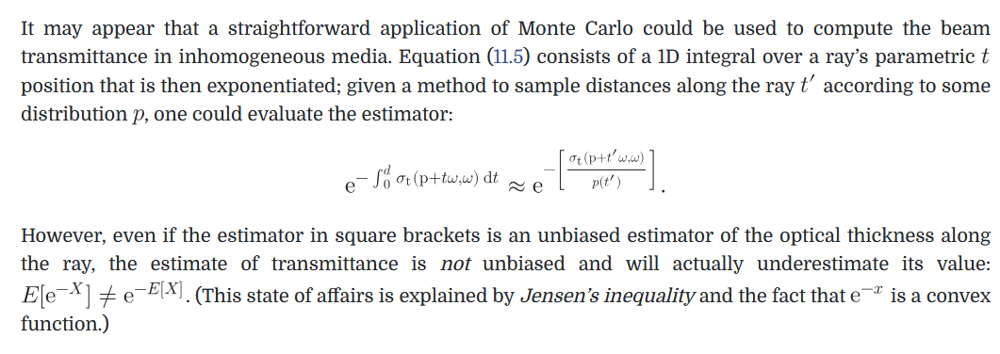
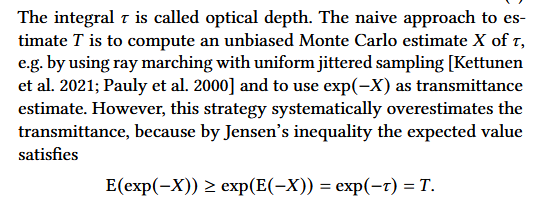
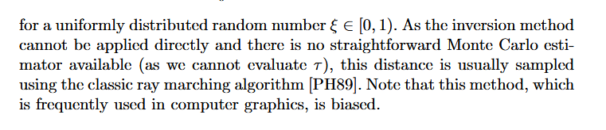
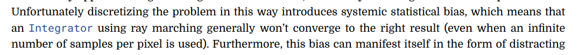

## How We Got Here

Recently - I've been doing some research into better sample placement for raymarching.

During that process, I've been reading some literature around unbiased transmittance estimators such as delta tracking, jackknife transmittance and others.

A common refrain you will encounter when reading this literature is about how raymarching to estimate transmittance is biased.

[PBRT](https://pbr-book.org/4ed/Volume_Scattering/Transmittance):

 

[Jackknife Transmittance and MIS Weight Estimation](https://dl.acm.org/doi/epdf/10.1145/3763273):



[Unbiased Global Illumination with Participating Media](https://www.uni-ulm.de/fileadmin/website_uni_ulm/iui.inst.100/institut/Papers/ugiwpm.pdf):



## What's The Problem?

Reading these papers, I struggled to understand _why_ transmittance from raymarching was biased.

I thought that these papers were stating that calculating transmittance as seen below was inherently biased.

```
float jitter = random01();

float opticalDepth = 0.0f;
for(float i = 0.0f; i < stepCount; i+=1.0f)
{
	opticalDepth += density((i + jitter) * stepSize) * stepSize;
}
float transmittance = exp(-opticalDepth);
```

PBRT's [3rd Edition](https://pbr-book.org/3ed-2018/Light_Transport_II_Volume_Rendering/Sampling_Volume_Scattering) states:



## The Truth

After further investigation and experimentation, I don't think these sources are suggesting that evaluating transmittance using raymarching is biased.

I.e. evaluating transmittance in the way seen in the code below is a completely valid and unbiased way to estimate transmittance.

```
float opticalDepthEstimate(float jitter)
{
	float opticalDepth = 0.0f;
	for(float i = 0; i < stepCount; i += 1.0f)
	{
		opticalDepth += density((i + jitter) * stepSize) * stepSize;
	}
	return opticalDepth;
}

float opticalDepth = 0.0;
for(float i = 0.0f; i < iterationCount; i += 1.0f)
{
	opticalDepth += opticalDepthEstimate(random01()) / iterationCount;
}

float transmittance = exp(-opticalDepth);
```

The problem, is that we don't estimate transmittance this way.

In practice, your code might look something like this (heavily simplified for demonstration):

```
float3 scattering = 0.0f;
for(int i = 0.0f; i < monteCarloIterations; i += 1.0f)
{
	float opticalDepth = opticalDepthEstimate(random01());
	float transmittance = exp(-opticalDepth);
	
	// Calculate how much light reaches our current sample point
	scattering += transmittance * light / monteCarloIterations;
}
```

The difference, is that we're averaging _transmittance_ as a part of our render. **Not** optical depth.

```
float opticalDepthEstimate(float jitter)
{
	float opticalDepth = 0.0f;
	for(float i = 0; i < stepCount; i += 1.0f)
	{
		opticalDepth += density((i + jitter) * stepSize) * stepSize;
	}
	return opticalDepth;
}

float transmittance = 0.0;
for(float i = 0.0f; i < iterationCount; i += 1.0f)
{
	transmittance += exp(-opticalDepthEstimate(random01())) / iterationCount;
}
```

The equation we're looking to evaluate is:

$$
exp(-\int opticalDepth(t)dt) \simeq exp(-E[opticalDepth])
$$
But the code above evaluates:

$$
E[exp(-opticalDepth)]
$$

And as Jensen's Inequality states:

$$
E[exp(-X)] \geq exp(-E[X])
$$

This is further reinforced if we return to the comment made in [Jackknife Transmittance and MIS Weight Estimation](https://dl.acm.org/doi/epdf/10.1145/3763273):


Note how the author states "this strategy systematically **overestimates** the transmittance". Pointing out that the _incorrect_ form of our estimator is the one where we average **transmittance**. The left term in the equation.

I thought the bias arose from our use of raymarching.

But the bias actually arises from our approach to averaging transmittance instead of averaging optical depth.

The paragraph even states:

> The naive approach to estimate T is to compute an unbiased Monte Carlo estimate X...and to use exp(-X) as transmittance estimate.

The mention of raymarching is simply an example of a method one could use to estimate the optical depth. Not the source of the problem.

## Conclusion

I struggled to find an explanation to this bias that "fit" my brain.

Hopefully this blog post will help anyone who is having a similar problem!

Let me know if you have any questions!